# Dataset Statistics


<details>
<summary>Datasets</summary>
<table border="1">
<tr>
<td valign="top" colspan="3">
<h3>Total:</h3>
</td>
<tr>
<td valign="top">

|         |      datasets |       records |
| ------- | ------------- | ------------- |
| free    |           999 | 1,628,135,845 |
| paid    |         1,637 | 2,037,456,669 |
| unknown |            17 |       948,370 |

</td>
<td valign="top">


</td>
<td valign="top">

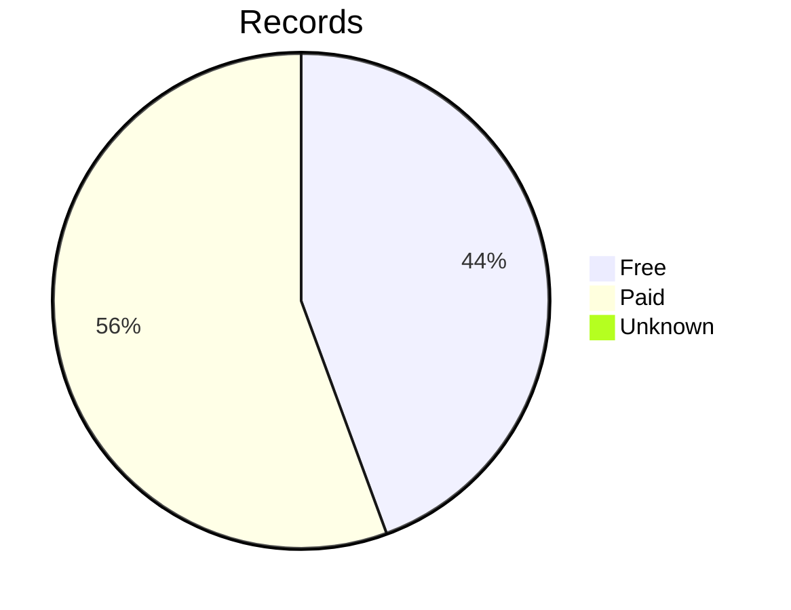
</td>
</tr>
</table>
</details>


<details>
<summary>Datasets By Region</summary>
<table border="1">
<tr>
<td valign="top" colspan="3">
<h2>Total</h2>
</td>
</tr>
<tr>
<td valign="top">

| title         |      datasets |       records |
| ------------- | ------------- | ------------- |
| Americas      |         1,042 | 1,643,914,473 |
| Asia          |             4 |     6,235,968 |
| Australasia   |           337 |    83,649,595 |
| Europe        |            48 |   115,165,976 |
| Great Britain |           984 | 1,649,254,268 |
| Ireland       |           237 |   168,318,802 |
| None          |             1 |         1,802 |

</td>
<td valign="top">

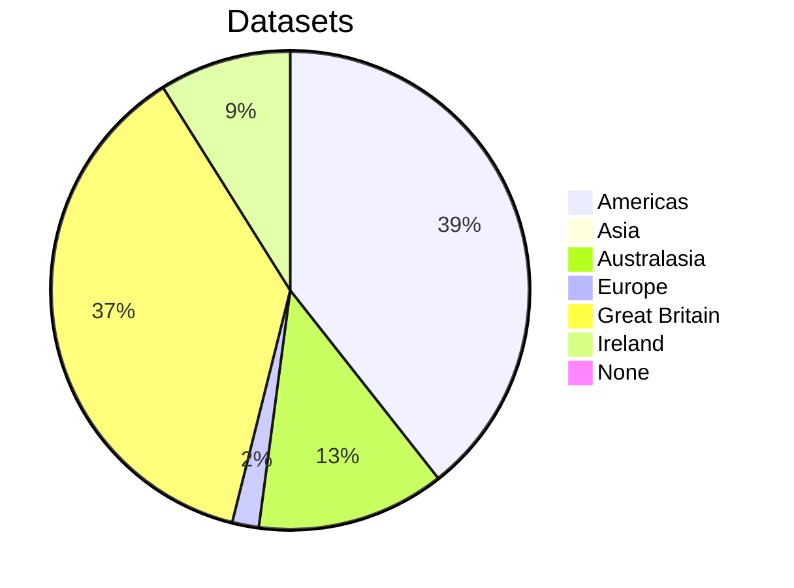
</td>
<td valign="top">


</td>
</tr>
<tr>
<td valign="top" colspan="3">
<h3>Americas:</h3>
</td>
</tr>
<tr>
<td valign="top">

|         |      datasets |       records |
| ------- | ------------- | ------------- |
| free    |           458 |   820,160,980 |
| paid    |           568 |   822,818,041 |
| unknown |            16 |       935,452 |

</td>
<td valign="top">

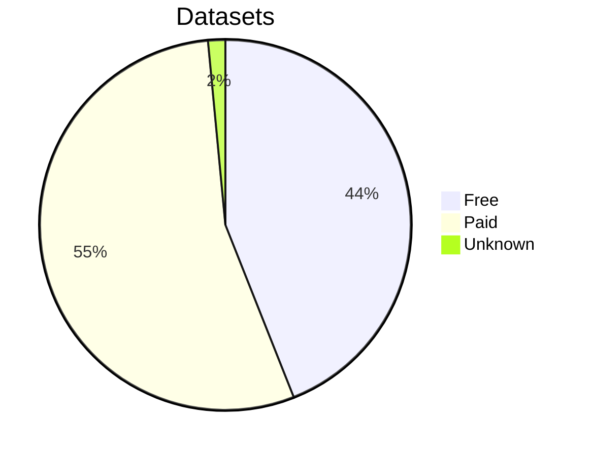
</td>
<td valign="top">

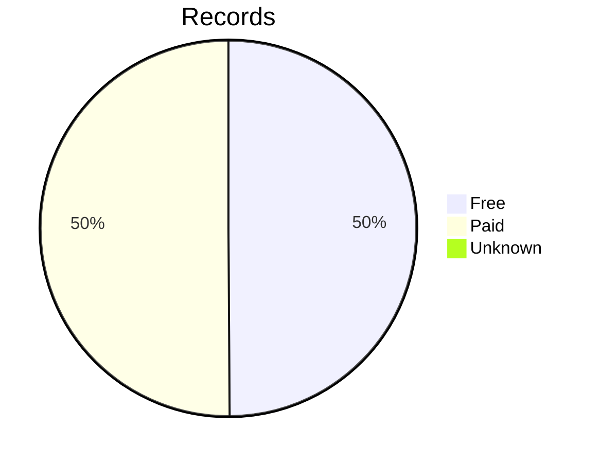
</td>
</tr>
<tr>
<td valign="top" colspan="3">
<h3>Asia:</h3>
</td>
</tr>
<tr>
<td valign="top">

|         |      datasets |       records |
| ------- | ------------- | ------------- |
| free    |             4 |     6,235,968 |
| paid    |             0 |             0 |
| unknown |             0 |             0 |

</td>
<td valign="top">

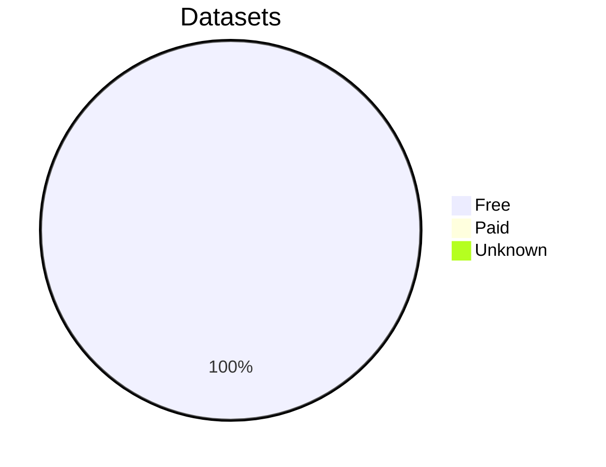
</td>
<td valign="top">

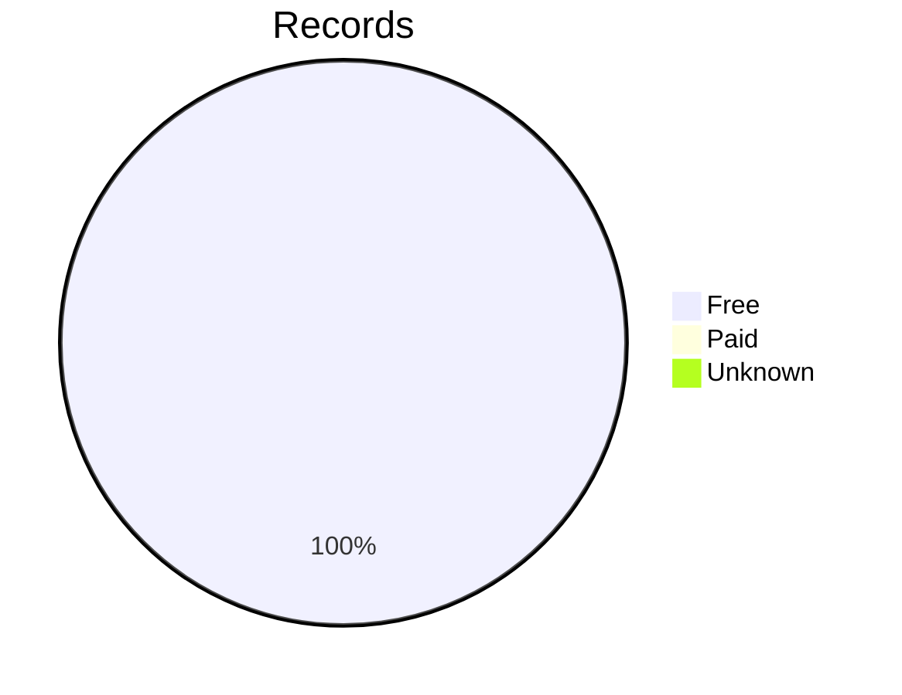
</td>
</tr>
<tr>
<td valign="top" colspan="3">
<h3>Australasia:</h3>
</td>
</tr>
<tr>
<td valign="top">

|         |      datasets |       records |
| ------- | ------------- | ------------- |
| free    |            56 |    17,304,163 |
| paid    |           281 |    66,345,432 |
| unknown |             0 |             0 |

</td>
<td valign="top">

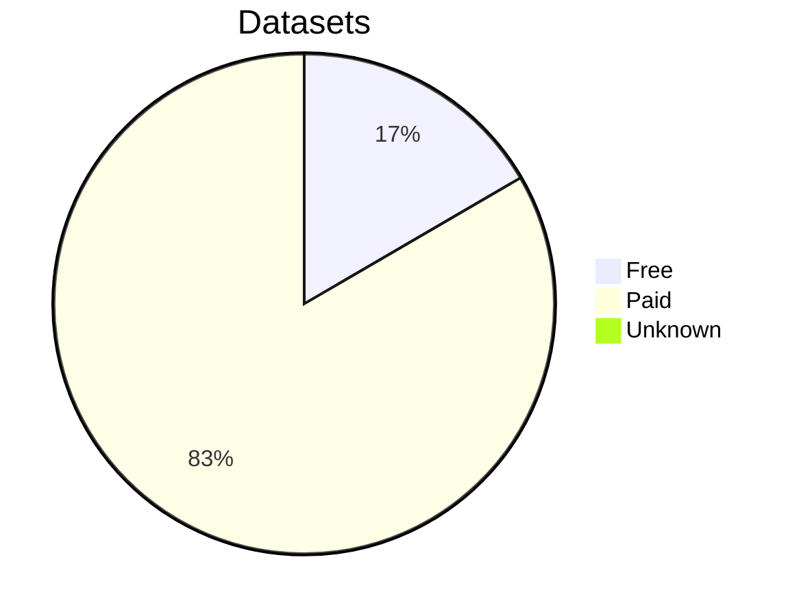
</td>
<td valign="top">

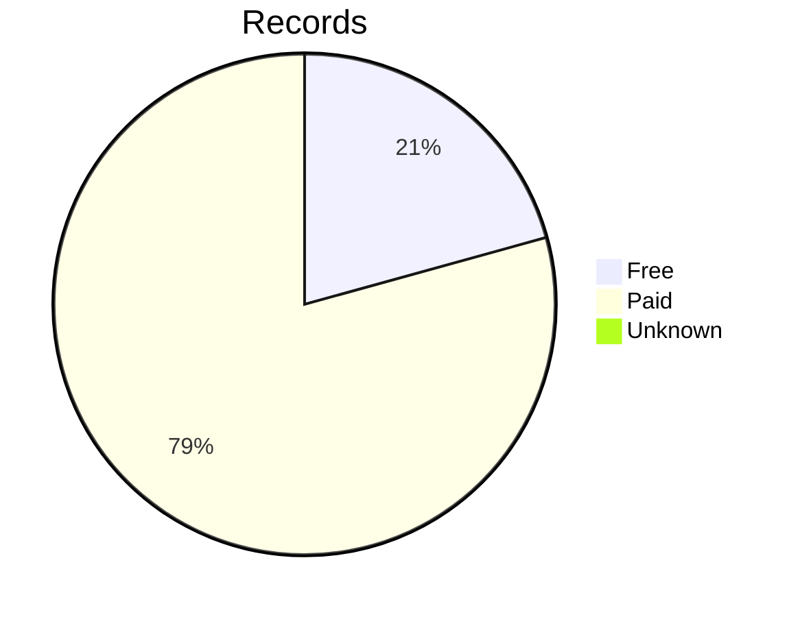
</td>
</tr>
<tr>
<td valign="top" colspan="3">
<h3>Europe:</h3>
</td>
</tr>
<tr>
<td valign="top">

|         |      datasets |       records |
| ------- | ------------- | ------------- |
| free    |            34 |   108,021,434 |
| paid    |            14 |     7,144,542 |
| unknown |             0 |             0 |

</td>
<td valign="top">

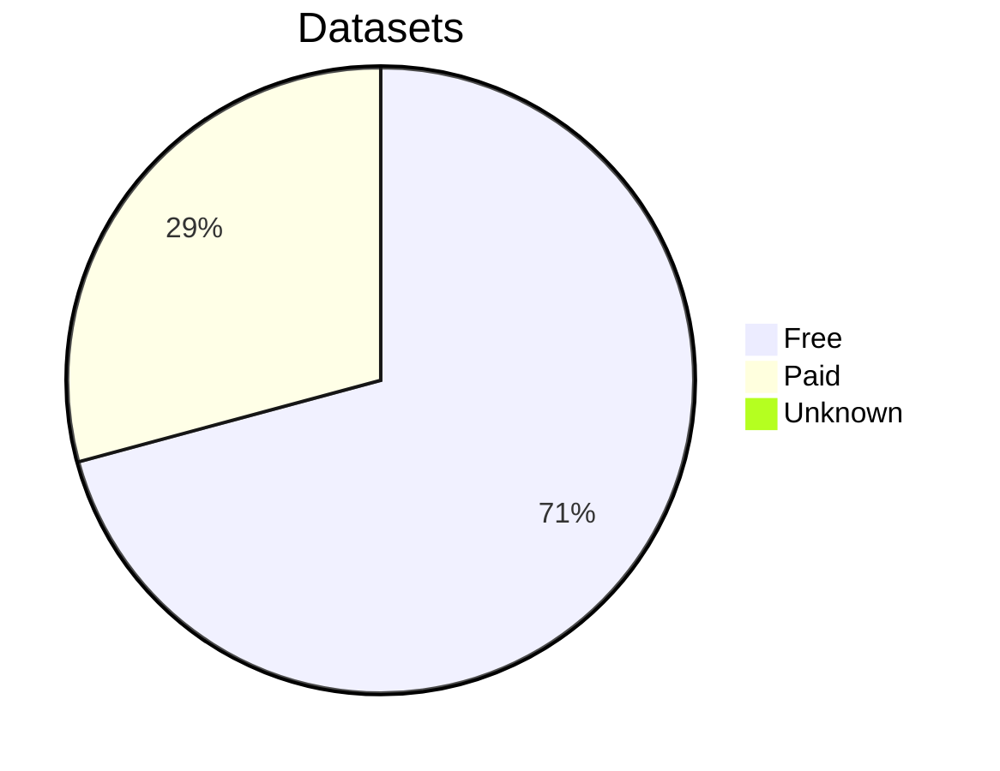
</td>
<td valign="top">


</td>
</tr>
<tr>
<td valign="top" colspan="3">
<h3>Great Britain:</h3>
</td>
</tr>
<tr>
<td valign="top">

|         |      datasets |       records |
| ------- | ------------- | ------------- |
| free    |           377 |   571,090,082 |
| paid    |           606 | 1,078,151,268 |
| unknown |             1 |        12,918 |

</td>
<td valign="top">


</td>
<td valign="top">


</td>
</tr>
<tr>
<td valign="top" colspan="3">
<h3>Ireland:</h3>
</td>
</tr>
<tr>
<td valign="top">

|         |      datasets |       records |
| ------- | ------------- | ------------- |
| free    |            70 |   105,323,218 |
| paid    |           167 |    62,995,584 |
| unknown |             0 |             0 |

</td>
<td valign="top">

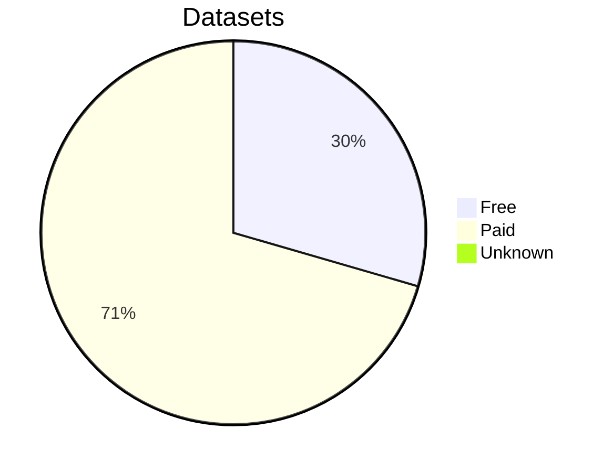
</td>
<td valign="top">


</td>
</tr>
<tr>
<td valign="top" colspan="3">
<h3>None:</h3>
</td>
</tr>
<tr>
<td valign="top">

|         |      datasets |       records |
| ------- | ------------- | ------------- |
| free    |             0 |             0 |
| paid    |             1 |         1,802 |
| unknown |             0 |             0 |

</td>
<td valign="top">

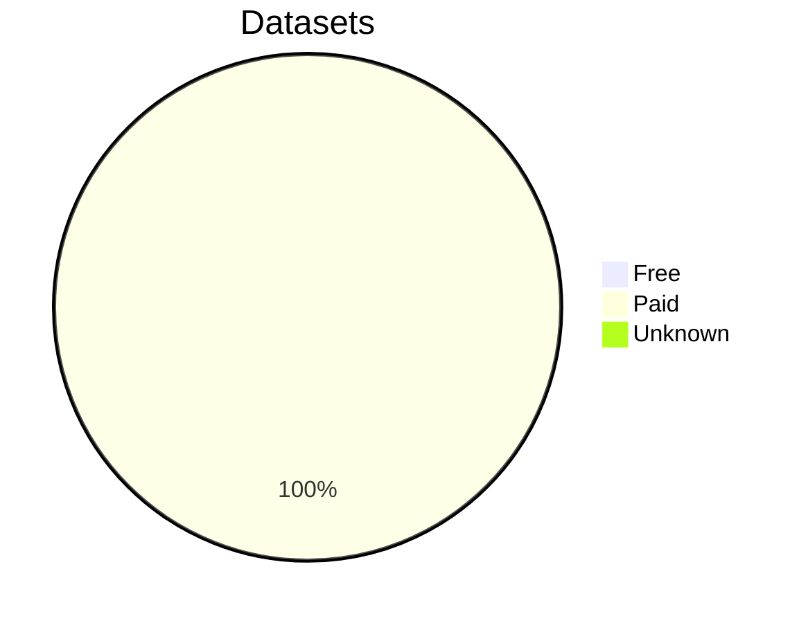
</td>
<td valign="top">


</td>
</tr>
</table>
</details>


<details>
<summary>Datasets By Parent Category</summary>
<table border="1">
<tr>
<td valign="top" colspan="3">
<h2>Total</h2>
</td>
</tr>
<tr>
<td valign="top">

| title                                    |      datasets |       records |
| ---------------------------------------- | ------------- | ------------- |
| Armed Forces & Conflict                  |           354 |   116,956,446 |
| Census, Land & Surveys                   |           260 | 1,440,926,235 |
| Churches & Religion                      |            30 |     3,901,200 |
| Education & Work                         |           152 |    28,044,720 |
| Institutions & Organisations             |           182 |    70,579,417 |
| Life Events (bmds)                       |           998 | 1,556,921,957 |
| Newspapers, Directories & Social History |           581 |   181,541,661 |
| Travel & Migration                       |            96 |   267,669,248 |

</td>
<td valign="top">

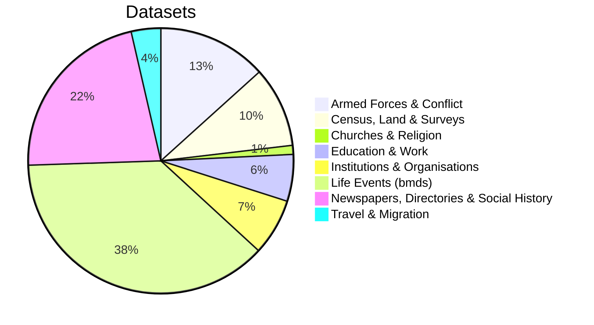
</td>
<td valign="top">

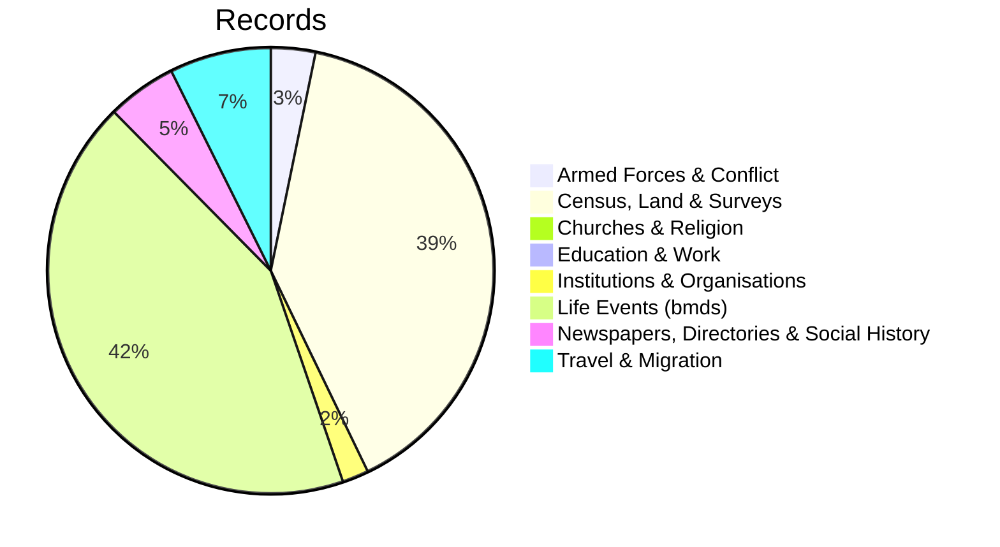
</td>
</tr>
<tr>
<td valign="top" colspan="3">
<h3>Armed Forces & Conflict:</h3>
</td>
</tr>
<tr>
<td valign="top">

|         |      datasets |       records |
| ------- | ------------- | ------------- |
| free    |            92 |    18,975,797 |
| paid    |           261 |    97,926,080 |
| unknown |             1 |        54,569 |

</td>
<td valign="top">

```mermaid
pie
title Datasets
  "Free": 26.0
  "Paid": 73.7
  "Unknown": 0.3
```
</td>
<td valign="top">

```mermaid
pie
title Records
  "Free": 16.2
  "Paid": 83.7
  "Unknown": 0.0
```
</td>
</tr>
<tr>
<td valign="top" colspan="3">
<h3>Census, Land & Surveys:</h3>
</td>
</tr>
<tr>
<td valign="top">

|         |      datasets |       records |
| ------- | ------------- | ------------- |
| free    |            91 |   244,260,599 |
| paid    |           166 | 1,196,617,409 |
| unknown |             3 |        48,227 |

</td>
<td valign="top">

```mermaid
pie
title Datasets
  "Free": 35.0
  "Paid": 63.8
  "Unknown": 1.2
```
</td>
<td valign="top">

```mermaid
pie
title Records
  "Free": 17.0
  "Paid": 83.0
  "Unknown": 0.0
```
</td>
</tr>
<tr>
<td valign="top" colspan="3">
<h3>Churches & Religion:</h3>
</td>
</tr>
<tr>
<td valign="top">

|         |      datasets |       records |
| ------- | ------------- | ------------- |
| free    |             5 |       772,740 |
| paid    |            25 |     3,128,460 |
| unknown |             0 |             0 |

</td>
<td valign="top">

```mermaid
pie
title Datasets
  "Free": 16.7
  "Paid": 83.3
  "Unknown": 0.0
```
</td>
<td valign="top">

```mermaid
pie
title Records
  "Free": 19.8
  "Paid": 80.2
  "Unknown": 0.0
```
</td>
</tr>
<tr>
<td valign="top" colspan="3">
<h3>Education & Work:</h3>
</td>
</tr>
<tr>
<td valign="top">

|         |      datasets |       records |
| ------- | ------------- | ------------- |
| free    |            27 |     3,777,244 |
| paid    |           125 |    24,267,476 |
| unknown |             0 |             0 |

</td>
<td valign="top">

```mermaid
pie
title Datasets
  "Free": 17.8
  "Paid": 82.2
  "Unknown": 0.0
```
</td>
<td valign="top">

```mermaid
pie
title Records
  "Free": 13.5
  "Paid": 86.5
  "Unknown": 0.0
```
</td>
</tr>
<tr>
<td valign="top" colspan="3">
<h3>Institutions & Organisations:</h3>
</td>
</tr>
<tr>
<td valign="top">

|         |      datasets |       records |
| ------- | ------------- | ------------- |
| free    |            49 |     8,132,750 |
| paid    |           131 |    62,421,906 |
| unknown |             2 |        24,761 |

</td>
<td valign="top">

```mermaid
pie
title Datasets
  "Free": 26.9
  "Paid": 72.0
  "Unknown": 1.1
```
</td>
<td valign="top">

```mermaid
pie
title Records
  "Free": 11.5
  "Paid": 88.4
  "Unknown": 0.0
```
</td>
</tr>
<tr>
<td valign="top" colspan="3">
<h3>Life Events (bmds):</h3>
</td>
</tr>
<tr>
<td valign="top">

|         |      datasets |       records |
| ------- | ------------- | ------------- |
| free    |           630 | 1,266,473,052 |
| paid    |           359 |   289,715,528 |
| unknown |             9 |       733,377 |

</td>
<td valign="top">

```mermaid
pie
title Datasets
  "Free": 63.1
  "Paid": 36.0
  "Unknown": 0.9
```
</td>
<td valign="top">

```mermaid
pie
title Records
  "Free": 81.3
  "Paid": 18.6
  "Unknown": 0.0
```
</td>
</tr>
<tr>
<td valign="top" colspan="3">
<h3>Newspapers, Directories & Social History:</h3>
</td>
</tr>
<tr>
<td valign="top">

|         |      datasets |       records |
| ------- | ------------- | ------------- |
| free    |            76 |    16,143,684 |
| paid    |           504 |   165,350,290 |
| unknown |             1 |        47,687 |

</td>
<td valign="top">

```mermaid
pie
title Datasets
  "Free": 13.1
  "Paid": 86.7
  "Unknown": 0.2
```
</td>
<td valign="top">

```mermaid
pie
title Records
  "Free": 8.9
  "Paid": 91.1
  "Unknown": 0.0
```
</td>
</tr>
<tr>
<td valign="top" colspan="3">
<h3>Travel & Migration:</h3>
</td>
</tr>
<tr>
<td valign="top">

|         |      datasets |       records |
| ------- | ------------- | ------------- |
| free    |            29 |    69,599,979 |
| paid    |            66 |   198,029,520 |
| unknown |             1 |        39,749 |

</td>
<td valign="top">

```mermaid
pie
title Datasets
  "Free": 30.2
  "Paid": 68.8
  "Unknown": 1.0
```
</td>
<td valign="top">

```mermaid
pie
title Records
  "Free": 26.0
  "Paid": 74.0
  "Unknown": 0.0
```
</td>
</tr>
</table>
</details>


<details>
<summary>Datasets By Region And Parent Category</summary>
<table border="1">
<tr>
<td valign="top" colspan="3">
<h2>Total</h2>
</td>
</tr>
<tr>
<td valign="top">

| title                                                   |      datasets |       records |
| ------------------------------------------------------- | ------------- | ------------- |
| Americas: Armed Forces & Conflict                       |           108 |    70,170,528 |
| Americas: Census, Land & Surveys                        |           111 |   743,971,935 |
| Americas: Churches & Religion                           |             9 |     1,146,392 |
| Americas: Education & Work                              |            23 |     1,203,542 |
| Americas: Institutions & Organisations                  |            42 |     5,217,702 |
| Americas: Life Events (bmds)                            |           339 |   654,407,651 |
| Americas: Newspapers, Directories & Social History      |           360 |    15,563,051 |
| Americas: Travel & Migration                            |            50 |   152,233,672 |
| Asia: Life Events (bmds)                                |             3 |     6,164,469 |
| Asia: Newspapers, Directories & Social History          |             1 |        71,499 |
| Australasia: Armed Forces & Conflict                    |            31 |     1,152,894 |
| Australasia: Census, Land & Surveys                     |            27 |    16,170,618 |
| Australasia: Churches & Religion                        |             7 |        20,929 |
| Australasia: Education & Work                           |            38 |     2,599,122 |
| Australasia: Institutions & Organisations               |            39 |     4,349,189 |
| Australasia: Life Events (bmds)                         |            97 |    29,551,534 |
| Australasia: Newspapers, Directories & Social History   |            69 |     2,135,395 |
| Australasia: Travel & Migration                         |            29 |    27,669,914 |
| Europe: Life Events (bmds)                              |            48 |   115,165,976 |
| Great Britain: Armed Forces & Conflict                  |           200 |    44,896,154 |
| Great Britain: Census, Land & Surveys                   |            95 |   664,676,099 |
| Great Britain: Churches & Religion                      |            10 |     1,196,982 |
| Great Britain: Education & Work                         |            76 |    22,392,838 |
| Great Britain: Institutions & Organisations             |            77 |    19,760,275 |
| Great Britain: Life Events (bmds)                       |           437 |   713,179,489 |
| Great Britain: Newspapers, Directories & Social History |            76 |   158,471,686 |
| Great Britain: Travel & Migration                       |            13 |    24,680,745 |
| Ireland: Armed Forces & Conflict                        |            14 |       735,068 |
| Ireland: Census, Land & Surveys                         |            27 |    16,107,583 |
| Ireland: Churches & Religion                            |             4 |     1,536,897 |
| Ireland: Education & Work                               |            15 |     1,849,218 |
| Ireland: Institutions & Organisations                   |            24 |    41,252,251 |
| Ireland: Life Events (bmds)                             |            74 |    38,452,838 |
| Ireland: Newspapers, Directories & Social History       |            75 |     5,300,030 |
| Ireland: Travel & Migration                             |             4 |    63,084,917 |
| None: Armed Forces & Conflict                           |             1 |         1,802 |

</td>
<td valign="top">

```mermaid
pie
title Datasets
  "Americas: Armed Forces & Conflict": 10.3
  "Americas: Census, Land & Surveys": 10.6
  "Americas: Churches & Religion": 0.9
  "Americas: Education & Work": 2.2
  "Americas: Institutions & Organisations": 4.0
  "Americas: Life Events (bmds)": 32.4
  "Americas: Newspapers, Directories & Social History": 34.4
  "Americas: Travel & Migration": 4.8
  "Asia: Life Events (bmds)": 0.3
  "Asia: Newspapers, Directories & Social History": 0.1
```
</td>
<td valign="top">

```mermaid
pie
title Records
  "Americas: Armed Forces & Conflict": 4.3
  "Americas: Census, Land & Surveys": 45.1
  "Americas: Churches & Religion": 0.1
  "Americas: Education & Work": 0.1
  "Americas: Institutions & Organisations": 0.3
  "Americas: Life Events (bmds)": 39.7
  "Americas: Newspapers, Directories & Social History": 0.9
  "Americas: Travel & Migration": 9.2
  "Asia: Life Events (bmds)": 0.4
  "Asia: Newspapers, Directories & Social History": 0.0
```
</td>
</tr>
<tr>
<td valign="top" colspan="3">
<h3>Americas: Armed Forces & Conflict:</h3>
</td>
</tr>
<tr>
<td valign="top">

|         |      datasets |       records |
| ------- | ------------- | ------------- |
| free    |            42 |     4,532,416 |
| paid    |            65 |    65,583,543 |
| unknown |             1 |        54,569 |

</td>
<td valign="top">

```mermaid
pie
title Datasets
  "Free": 38.9
  "Paid": 60.2
  "Unknown": 0.9
```
</td>
<td valign="top">

```mermaid
pie
title Records
  "Free": 6.5
  "Paid": 93.5
  "Unknown": 0.1
```
</td>
</tr>
<tr>
<td valign="top" colspan="3">
<h3>Americas: Census, Land & Surveys:</h3>
</td>
</tr>
<tr>
<td valign="top">

|         |      datasets |       records |
| ------- | ------------- | ------------- |
| free    |            54 |   175,825,797 |
| paid    |            55 |   568,110,829 |
| unknown |             2 |        35,309 |

</td>
<td valign="top">

```mermaid
pie
title Datasets
  "Free": 48.6
  "Paid": 49.5
  "Unknown": 1.8
```
</td>
<td valign="top">

```mermaid
pie
title Records
  "Free": 23.6
  "Paid": 76.4
  "Unknown": 0.0
```
</td>
</tr>
<tr>
<td valign="top" colspan="3">
<h3>Americas: Churches & Religion:</h3>
</td>
</tr>
<tr>
<td valign="top">

|         |      datasets |       records |
| ------- | ------------- | ------------- |
| free    |             3 |       714,205 |
| paid    |             6 |       432,187 |
| unknown |             0 |             0 |

</td>
<td valign="top">

```mermaid
pie
title Datasets
  "Free": 33.3
  "Paid": 66.7
  "Unknown": 0.0
```
</td>
<td valign="top">

```mermaid
pie
title Records
  "Free": 62.3
  "Paid": 37.7
  "Unknown": 0.0
```
</td>
</tr>
<tr>
<td valign="top" colspan="3">
<h3>Americas: Education & Work:</h3>
</td>
</tr>
<tr>
<td valign="top">

|         |      datasets |       records |
| ------- | ------------- | ------------- |
| free    |             8 |     1,202,296 |
| paid    |            15 |         1,246 |
| unknown |             0 |             0 |

</td>
<td valign="top">

```mermaid
pie
title Datasets
  "Free": 34.8
  "Paid": 65.2
  "Unknown": 0.0
```
</td>
<td valign="top">

```mermaid
pie
title Records
  "Free": 99.9
  "Paid": 0.1
  "Unknown": 0.0
```
</td>
</tr>
<tr>
<td valign="top" colspan="3">
<h3>Americas: Institutions & Organisations:</h3>
</td>
</tr>
<tr>
<td valign="top">

|         |      datasets |       records |
| ------- | ------------- | ------------- |
| free    |            29 |     5,156,287 |
| paid    |            11 |        36,654 |
| unknown |             2 |        24,761 |

</td>
<td valign="top">

```mermaid
pie
title Datasets
  "Free": 69.0
  "Paid": 26.2
  "Unknown": 4.8
```
</td>
<td valign="top">

```mermaid
pie
title Records
  "Free": 98.8
  "Paid": 0.7
  "Unknown": 0.5
```
</td>
</tr>
<tr>
<td valign="top" colspan="3">
<h3>Americas: Life Events (bmds):</h3>
</td>
</tr>
<tr>
<td valign="top">

|         |      datasets |       records |
| ------- | ------------- | ------------- |
| free    |           256 |   612,563,372 |
| paid    |            74 |    41,110,902 |
| unknown |             9 |       733,377 |

</td>
<td valign="top">

```mermaid
pie
title Datasets
  "Free": 75.5
  "Paid": 21.8
  "Unknown": 2.7
```
</td>
<td valign="top">

```mermaid
pie
title Records
  "Free": 93.6
  "Paid": 6.3
  "Unknown": 0.1
```
</td>
</tr>
<tr>
<td valign="top" colspan="3">
<h3>Americas: Newspapers, Directories & Social History:</h3>
</td>
</tr>
<tr>
<td valign="top">

|         |      datasets |       records |
| ------- | ------------- | ------------- |
| free    |            49 |    13,731,838 |
| paid    |           310 |     1,783,526 |
| unknown |             1 |        47,687 |

</td>
<td valign="top">

```mermaid
pie
title Datasets
  "Free": 13.6
  "Paid": 86.1
  "Unknown": 0.3
```
</td>
<td valign="top">

```mermaid
pie
title Records
  "Free": 88.2
  "Paid": 11.5
  "Unknown": 0.3
```
</td>
</tr>
<tr>
<td valign="top" colspan="3">
<h3>Americas: Travel & Migration:</h3>
</td>
</tr>
<tr>
<td valign="top">

|         |      datasets |       records |
| ------- | ------------- | ------------- |
| free    |            17 |     6,434,769 |
| paid    |            32 |   145,759,154 |
| unknown |             1 |        39,749 |

</td>
<td valign="top">

```mermaid
pie
title Datasets
  "Free": 34.0
  "Paid": 64.0
  "Unknown": 2.0
```
</td>
<td valign="top">

```mermaid
pie
title Records
  "Free": 4.2
  "Paid": 95.7
  "Unknown": 0.0
```
</td>
</tr>
<tr>
<td valign="top" colspan="3">
<h3>Asia: Life Events (bmds):</h3>
</td>
</tr>
<tr>
<td valign="top">

|         |      datasets |       records |
| ------- | ------------- | ------------- |
| free    |             3 |     6,164,469 |
| paid    |             0 |             0 |
| unknown |             0 |             0 |

</td>
<td valign="top">

```mermaid
pie
title Datasets
  "Free": 100.0
  "Paid": 0.0
  "Unknown": 0.0
```
</td>
<td valign="top">

```mermaid
pie
title Records
  "Free": 100.0
  "Paid": 0.0
  "Unknown": 0.0
```
</td>
</tr>
<tr>
<td valign="top" colspan="3">
<h3>Asia: Newspapers, Directories & Social History:</h3>
</td>
</tr>
<tr>
<td valign="top">

|         |      datasets |       records |
| ------- | ------------- | ------------- |
| free    |             1 |        71,499 |
| paid    |             0 |             0 |
| unknown |             0 |             0 |

</td>
<td valign="top">

```mermaid
pie
title Datasets
  "Free": 100.0
  "Paid": 0.0
  "Unknown": 0.0
```
</td>
<td valign="top">

```mermaid
pie
title Records
  "Free": 100.0
  "Paid": 0.0
  "Unknown": 0.0
```
</td>
</tr>
<tr>
<td valign="top" colspan="3">
<h3>Australasia: Armed Forces & Conflict:</h3>
</td>
</tr>
<tr>
<td valign="top">

|         |      datasets |       records |
| ------- | ------------- | ------------- |
| free    |             4 |       165,084 |
| paid    |            27 |       987,810 |
| unknown |             0 |             0 |

</td>
<td valign="top">

```mermaid
pie
title Datasets
  "Free": 12.9
  "Paid": 87.1
  "Unknown": 0.0
```
</td>
<td valign="top">

```mermaid
pie
title Records
  "Free": 14.3
  "Paid": 85.7
  "Unknown": 0.0
```
</td>
</tr>
<tr>
<td valign="top" colspan="3">
<h3>Australasia: Census, Land & Surveys:</h3>
</td>
</tr>
<tr>
<td valign="top">

|         |      datasets |       records |
| ------- | ------------- | ------------- |
| free    |             4 |        62,108 |
| paid    |            23 |    16,108,510 |
| unknown |             0 |             0 |

</td>
<td valign="top">

```mermaid
pie
title Datasets
  "Free": 14.8
  "Paid": 85.2
  "Unknown": 0.0
```
</td>
<td valign="top">

```mermaid
pie
title Records
  "Free": 0.4
  "Paid": 99.6
  "Unknown": 0.0
```
</td>
</tr>
<tr>
<td valign="top" colspan="3">
<h3>Australasia: Churches & Religion:</h3>
</td>
</tr>
<tr>
<td valign="top">

|         |      datasets |       records |
| ------- | ------------- | ------------- |
| free    |             0 |             0 |
| paid    |             7 |        20,929 |
| unknown |             0 |             0 |

</td>
<td valign="top">

```mermaid
pie
title Datasets
  "Free": 0.0
  "Paid": 100.0
  "Unknown": 0.0
```
</td>
<td valign="top">

```mermaid
pie
title Records
  "Free": 0.0
  "Paid": 100.0
  "Unknown": 0.0
```
</td>
</tr>
<tr>
<td valign="top" colspan="3">
<h3>Australasia: Education & Work:</h3>
</td>
</tr>
<tr>
<td valign="top">

|         |      datasets |       records |
| ------- | ------------- | ------------- |
| free    |             3 |        45,922 |
| paid    |            35 |     2,553,200 |
| unknown |             0 |             0 |

</td>
<td valign="top">

```mermaid
pie
title Datasets
  "Free": 7.9
  "Paid": 92.1
  "Unknown": 0.0
```
</td>
<td valign="top">

```mermaid
pie
title Records
  "Free": 1.8
  "Paid": 98.2
  "Unknown": 0.0
```
</td>
</tr>
<tr>
<td valign="top" colspan="3">
<h3>Australasia: Institutions & Organisations:</h3>
</td>
</tr>
<tr>
<td valign="top">

|         |      datasets |       records |
| ------- | ------------- | ------------- |
| free    |             4 |        60,997 |
| paid    |            35 |     4,288,192 |
| unknown |             0 |             0 |

</td>
<td valign="top">

```mermaid
pie
title Datasets
  "Free": 10.3
  "Paid": 89.7
  "Unknown": 0.0
```
</td>
<td valign="top">

```mermaid
pie
title Records
  "Free": 1.4
  "Paid": 98.6
  "Unknown": 0.0
```
</td>
</tr>
<tr>
<td valign="top" colspan="3">
<h3>Australasia: Life Events (bmds):</h3>
</td>
</tr>
<tr>
<td valign="top">

|         |      datasets |       records |
| ------- | ------------- | ------------- |
| free    |            31 |    16,885,647 |
| paid    |            66 |    12,665,887 |
| unknown |             0 |             0 |

</td>
<td valign="top">

```mermaid
pie
title Datasets
  "Free": 32.0
  "Paid": 68.0
  "Unknown": 0.0
```
</td>
<td valign="top">

```mermaid
pie
title Records
  "Free": 57.1
  "Paid": 42.9
  "Unknown": 0.0
```
</td>
</tr>
<tr>
<td valign="top" colspan="3">
<h3>Australasia: Newspapers, Directories & Social History:</h3>
</td>
</tr>
<tr>
<td valign="top">

|         |      datasets |       records |
| ------- | ------------- | ------------- |
| free    |             6 |        15,560 |
| paid    |            63 |     2,119,835 |
| unknown |             0 |             0 |

</td>
<td valign="top">

```mermaid
pie
title Datasets
  "Free": 8.7
  "Paid": 91.3
  "Unknown": 0.0
```
</td>
<td valign="top">

```mermaid
pie
title Records
  "Free": 0.7
  "Paid": 99.3
  "Unknown": 0.0
```
</td>
</tr>
<tr>
<td valign="top" colspan="3">
<h3>Australasia: Travel & Migration:</h3>
</td>
</tr>
<tr>
<td valign="top">

|         |      datasets |       records |
| ------- | ------------- | ------------- |
| free    |             4 |        68,845 |
| paid    |            25 |    27,601,069 |
| unknown |             0 |             0 |

</td>
<td valign="top">

```mermaid
pie
title Datasets
  "Free": 13.8
  "Paid": 86.2
  "Unknown": 0.0
```
</td>
<td valign="top">

```mermaid
pie
title Records
  "Free": 0.2
  "Paid": 99.8
  "Unknown": 0.0
```
</td>
</tr>
<tr>
<td valign="top" colspan="3">
<h3>Europe: Life Events (bmds):</h3>
</td>
</tr>
<tr>
<td valign="top">

|         |      datasets |       records |
| ------- | ------------- | ------------- |
| free    |            34 |   108,021,434 |
| paid    |            14 |     7,144,542 |
| unknown |             0 |             0 |

</td>
<td valign="top">

```mermaid
pie
title Datasets
  "Free": 70.8
  "Paid": 29.2
  "Unknown": 0.0
```
</td>
<td valign="top">

```mermaid
pie
title Records
  "Free": 93.8
  "Paid": 6.2
  "Unknown": 0.0
```
</td>
</tr>
<tr>
<td valign="top" colspan="3">
<h3>Great Britain: Armed Forces & Conflict:</h3>
</td>
</tr>
<tr>
<td valign="top">

|         |      datasets |       records |
| ------- | ------------- | ------------- |
| free    |            41 |    14,046,825 |
| paid    |           159 |    30,849,329 |
| unknown |             0 |             0 |

</td>
<td valign="top">

```mermaid
pie
title Datasets
  "Free": 20.5
  "Paid": 79.5
  "Unknown": 0.0
```
</td>
<td valign="top">

```mermaid
pie
title Records
  "Free": 31.3
  "Paid": 68.7
  "Unknown": 0.0
```
</td>
</tr>
<tr>
<td valign="top" colspan="3">
<h3>Great Britain: Census, Land & Surveys:</h3>
</td>
</tr>
<tr>
<td valign="top">

|         |      datasets |       records |
| ------- | ------------- | ------------- |
| free    |            24 |    56,517,433 |
| paid    |            70 |   608,145,748 |
| unknown |             1 |        12,918 |

</td>
<td valign="top">

```mermaid
pie
title Datasets
  "Free": 25.3
  "Paid": 73.7
  "Unknown": 1.1
```
</td>
<td valign="top">

```mermaid
pie
title Records
  "Free": 8.5
  "Paid": 91.5
  "Unknown": 0.0
```
</td>
</tr>
<tr>
<td valign="top" colspan="3">
<h3>Great Britain: Churches & Religion:</h3>
</td>
</tr>
<tr>
<td valign="top">

|         |      datasets |       records |
| ------- | ------------- | ------------- |
| free    |             1 |         6,474 |
| paid    |             9 |     1,190,508 |
| unknown |             0 |             0 |

</td>
<td valign="top">

```mermaid
pie
title Datasets
  "Free": 10.0
  "Paid": 90.0
  "Unknown": 0.0
```
</td>
<td valign="top">

```mermaid
pie
title Records
  "Free": 0.5
  "Paid": 99.5
  "Unknown": 0.0
```
</td>
</tr>
<tr>
<td valign="top" colspan="3">
<h3>Great Britain: Education & Work:</h3>
</td>
</tr>
<tr>
<td valign="top">

|         |      datasets |       records |
| ------- | ------------- | ------------- |
| free    |            14 |     1,696,148 |
| paid    |            62 |    20,696,690 |
| unknown |             0 |             0 |

</td>
<td valign="top">

```mermaid
pie
title Datasets
  "Free": 18.4
  "Paid": 81.6
  "Unknown": 0.0
```
</td>
<td valign="top">

```mermaid
pie
title Records
  "Free": 7.6
  "Paid": 92.4
  "Unknown": 0.0
```
</td>
</tr>
<tr>
<td valign="top" colspan="3">
<h3>Great Britain: Institutions & Organisations:</h3>
</td>
</tr>
<tr>
<td valign="top">

|         |      datasets |       records |
| ------- | ------------- | ------------- |
| free    |            12 |     2,547,088 |
| paid    |            65 |    17,213,187 |
| unknown |             0 |             0 |

</td>
<td valign="top">

```mermaid
pie
title Datasets
  "Free": 15.6
  "Paid": 84.4
  "Unknown": 0.0
```
</td>
<td valign="top">

```mermaid
pie
title Records
  "Free": 12.9
  "Paid": 87.1
  "Unknown": 0.0
```
</td>
</tr>
<tr>
<td valign="top" colspan="3">
<h3>Great Britain: Life Events (bmds):</h3>
</td>
</tr>
<tr>
<td valign="top">

|         |      datasets |       records |
| ------- | ------------- | ------------- |
| free    |           266 |   493,925,523 |
| paid    |           171 |   219,253,966 |
| unknown |             0 |             0 |

</td>
<td valign="top">

```mermaid
pie
title Datasets
  "Free": 60.9
  "Paid": 39.1
  "Unknown": 0.0
```
</td>
<td valign="top">

```mermaid
pie
title Records
  "Free": 69.3
  "Paid": 30.7
  "Unknown": 0.0
```
</td>
</tr>
<tr>
<td valign="top" colspan="3">
<h3>Great Britain: Newspapers, Directories & Social History:</h3>
</td>
</tr>
<tr>
<td valign="top">

|         |      datasets |       records |
| ------- | ------------- | ------------- |
| free    |            12 |     2,277,695 |
| paid    |            64 |   156,193,991 |
| unknown |             0 |             0 |

</td>
<td valign="top">

```mermaid
pie
title Datasets
  "Free": 15.8
  "Paid": 84.2
  "Unknown": 0.0
```
</td>
<td valign="top">

```mermaid
pie
title Records
  "Free": 1.4
  "Paid": 98.6
  "Unknown": 0.0
```
</td>
</tr>
<tr>
<td valign="top" colspan="3">
<h3>Great Britain: Travel & Migration:</h3>
</td>
</tr>
<tr>
<td valign="top">

|         |      datasets |       records |
| ------- | ------------- | ------------- |
| free    |             7 |        72,896 |
| paid    |             6 |    24,607,849 |
| unknown |             0 |             0 |

</td>
<td valign="top">

```mermaid
pie
title Datasets
  "Free": 53.8
  "Paid": 46.2
  "Unknown": 0.0
```
</td>
<td valign="top">

```mermaid
pie
title Records
  "Free": 0.3
  "Paid": 99.7
  "Unknown": 0.0
```
</td>
</tr>
<tr>
<td valign="top" colspan="3">
<h3>Ireland: Armed Forces & Conflict:</h3>
</td>
</tr>
<tr>
<td valign="top">

|         |      datasets |       records |
| ------- | ------------- | ------------- |
| free    |             5 |       231,472 |
| paid    |             9 |       503,596 |
| unknown |             0 |             0 |

</td>
<td valign="top">

```mermaid
pie
title Datasets
  "Free": 35.7
  "Paid": 64.3
  "Unknown": 0.0
```
</td>
<td valign="top">

```mermaid
pie
title Records
  "Free": 31.5
  "Paid": 68.5
  "Unknown": 0.0
```
</td>
</tr>
<tr>
<td valign="top" colspan="3">
<h3>Ireland: Census, Land & Surveys:</h3>
</td>
</tr>
<tr>
<td valign="top">

|         |      datasets |       records |
| ------- | ------------- | ------------- |
| free    |             9 |    11,855,261 |
| paid    |            18 |     4,252,322 |
| unknown |             0 |             0 |

</td>
<td valign="top">

```mermaid
pie
title Datasets
  "Free": 33.3
  "Paid": 66.7
  "Unknown": 0.0
```
</td>
<td valign="top">

```mermaid
pie
title Records
  "Free": 73.6
  "Paid": 26.4
  "Unknown": 0.0
```
</td>
</tr>
<tr>
<td valign="top" colspan="3">
<h3>Ireland: Churches & Religion:</h3>
</td>
</tr>
<tr>
<td valign="top">

|         |      datasets |       records |
| ------- | ------------- | ------------- |
| free    |             1 |        52,061 |
| paid    |             3 |     1,484,836 |
| unknown |             0 |             0 |

</td>
<td valign="top">

```mermaid
pie
title Datasets
  "Free": 25.0
  "Paid": 75.0
  "Unknown": 0.0
```
</td>
<td valign="top">

```mermaid
pie
title Records
  "Free": 3.4
  "Paid": 96.6
  "Unknown": 0.0
```
</td>
</tr>
<tr>
<td valign="top" colspan="3">
<h3>Ireland: Education & Work:</h3>
</td>
</tr>
<tr>
<td valign="top">

|         |      datasets |       records |
| ------- | ------------- | ------------- |
| free    |             2 |       832,878 |
| paid    |            13 |     1,016,340 |
| unknown |             0 |             0 |

</td>
<td valign="top">

```mermaid
pie
title Datasets
  "Free": 13.3
  "Paid": 86.7
  "Unknown": 0.0
```
</td>
<td valign="top">

```mermaid
pie
title Records
  "Free": 45.0
  "Paid": 55.0
  "Unknown": 0.0
```
</td>
</tr>
<tr>
<td valign="top" colspan="3">
<h3>Ireland: Institutions & Organisations:</h3>
</td>
</tr>
<tr>
<td valign="top">

|         |      datasets |       records |
| ------- | ------------- | ------------- |
| free    |             4 |       368,378 |
| paid    |            20 |    40,883,873 |
| unknown |             0 |             0 |

</td>
<td valign="top">

```mermaid
pie
title Datasets
  "Free": 16.7
  "Paid": 83.3
  "Unknown": 0.0
```
</td>
<td valign="top">

```mermaid
pie
title Records
  "Free": 0.9
  "Paid": 99.1
  "Unknown": 0.0
```
</td>
</tr>
<tr>
<td valign="top" colspan="3">
<h3>Ireland: Life Events (bmds):</h3>
</td>
</tr>
<tr>
<td valign="top">

|         |      datasets |       records |
| ------- | ------------- | ------------- |
| free    |            40 |    28,912,607 |
| paid    |            34 |     9,540,231 |
| unknown |             0 |             0 |

</td>
<td valign="top">

```mermaid
pie
title Datasets
  "Free": 54.1
  "Paid": 45.9
  "Unknown": 0.0
```
</td>
<td valign="top">

```mermaid
pie
title Records
  "Free": 75.2
  "Paid": 24.8
  "Unknown": 0.0
```
</td>
</tr>
<tr>
<td valign="top" colspan="3">
<h3>Ireland: Newspapers, Directories & Social History:</h3>
</td>
</tr>
<tr>
<td valign="top">

|         |      datasets |       records |
| ------- | ------------- | ------------- |
| free    |             8 |        47,092 |
| paid    |            67 |     5,252,938 |
| unknown |             0 |             0 |

</td>
<td valign="top">

```mermaid
pie
title Datasets
  "Free": 10.7
  "Paid": 89.3
  "Unknown": 0.0
```
</td>
<td valign="top">

```mermaid
pie
title Records
  "Free": 0.9
  "Paid": 99.1
  "Unknown": 0.0
```
</td>
</tr>
<tr>
<td valign="top" colspan="3">
<h3>Ireland: Travel & Migration:</h3>
</td>
</tr>
<tr>
<td valign="top">

|         |      datasets |       records |
| ------- | ------------- | ------------- |
| free    |             1 |    63,023,469 |
| paid    |             3 |        61,448 |
| unknown |             0 |             0 |

</td>
<td valign="top">

```mermaid
pie
title Datasets
  "Free": 25.0
  "Paid": 75.0
  "Unknown": 0.0
```
</td>
<td valign="top">

```mermaid
pie
title Records
  "Free": 99.9
  "Paid": 0.1
  "Unknown": 0.0
```
</td>
</tr>
<tr>
<td valign="top" colspan="3">
<h3>None: Armed Forces & Conflict:</h3>
</td>
</tr>
<tr>
<td valign="top">

|         |      datasets |       records |
| ------- | ------------- | ------------- |
| free    |             0 |             0 |
| paid    |             1 |         1,802 |
| unknown |             0 |             0 |

</td>
<td valign="top">

```mermaid
pie
title Datasets
  "Free": 0.0
  "Paid": 100.0
  "Unknown": 0.0
```
</td>
<td valign="top">

```mermaid
pie
title Records
  "Free": 0.0
  "Paid": 100.0
  "Unknown": 0.0
```
</td>
</tr>
</table>
</details>


<details>
<summary>Biggest Free Datasets By Count</summary>
<table border="1">
<tr>
<td valign="top" colspan="3">
<tr>
<td valign="top" colspan="3">

| dataset                                         |         count |
| ----------------------------------------------- | ------------- |
| United States Marriages                         |   249,108,042 |
| England & Wales Births 1837-2006                |   133,086,909 |
| US Census 1940                                  |   132,843,607 |
| England & Wales Marriages 1837-2005             |    95,653,033 |
| Social Security Death Index                     |    86,128,596 |
| United States Obituary Notices                  |    79,079,230 |
| England Births & Baptisms 1538-1975             |    64,372,361 |
| British & Irish Roots Collection                |    63,023,469 |
| Mexico Baptism Index 1560-1950                  |    43,301,066 |
| Germany Birth And Baptism Index 1558-1898       |    37,607,429 |
| England Marriages 1538-1973                     |    31,631,839 |
| 1881 England, Wales & Scotland Census           |    29,840,169 |
| United States Billion Graves Index              |    21,782,954 |
| Germany Marriage Index 1558-1929                |    16,829,448 |
| California Births, 1970-1995                    |    13,425,340 |
| Mexico Marriage Index 1570-1950                 |    12,483,056 |
| Scotland, Parish Births & Baptisms 1564-1929    |    10,543,847 |
| Irish Births 1864-1958                          |     9,455,120 |
| Yorkshire Baptisms                              |     9,201,991 |
| Sweden Baptisms 1611-1920                       |     9,007,881 |
| California, Death Record Index, 1940-1997       |     8,361,920 |
| Spain Baptisms 1502-1940                        |     8,330,113 |
| Ireland Roman Catholic Parish Baptisms          |     7,396,885 |
| Norway Baptisms 1634-1927                       |     7,327,082 |
| Canada Census 1911                              |     7,157,334 |
| England, Boyd's Marriage Indexes, 1538-1850     |     7,113,964 |
| Texas Divorce Indexes                           |     7,004,626 |
| Scotland, Parish Marriages & Banns 1561-1893    |     5,875,752 |
| Canada Census 1901                              |     5,167,206 |
| Philippines Deaths & Burials 1726-1957          |     5,057,703 |
| Kentucky Birth Records                          |     5,043,126 |
| Finland Baptism Index 1657-1890                 |     4,758,185 |
| Irish Marriages 1845-1958                       |     4,567,394 |
| Canada Census 1891                              |     4,539,639 |
| Yorkshire Marriages                             |     4,470,512 |
| Ireland Census 1901                             |     4,398,289 |
| Ireland Census 1911                             |     4,390,240 |
| Spain Marriages 1565-1950                       |     4,275,076 |
| Canada Census 1881                              |     4,273,962 |
| Ohio Divorce Records, 1962-2011                 |     4,259,660 |
| Peru, Lima, Civil Registration Births 1874-1996 |     3,870,981 |
| Peru Baptisms 1556-1930                         |     3,699,733 |
| Norfolk Baptisms                                |     3,600,230 |
| Kent Baptisms                                   |     3,561,462 |
| Canada Census 1871                              |     3,292,788 |
| Denmark Marriages 1635-1916                     |     3,219,876 |
| Kent Marriages And Banns                        |     3,175,396 |
| United States, National Veterans Cemetery Index |     3,166,846 |
| Denmark Baptisms 1618-1923                      |     3,148,542 |
| Nicaragua Civil Registration 1809-2011          |     3,135,468 |

</td>
</tr>
</table>
</details>


<details>
<summary>Biggest Paid Datasets By Count</summary>
<table border="1">
<tr>
<td valign="top" colspan="3">
<tr>
<td valign="top" colspan="3">

| dataset                                                        |         count |
| -------------------------------------------------------------- | ------------- |
| England & Wales, Electoral Registers 1910-1932                 |   157,221,850 |
| Uk Electoral Registers & Companies House Directors             |   124,203,354 |
| US Census 1930                                                 |   123,501,733 |
| United States, Passenger And Crew Lists                        |   118,662,176 |
| People In The News                                             |   108,735,837 |
| US Census 1920                                                 |   107,126,219 |
| US Census 1910                                                 |    92,346,580 |
| England & Wales Deaths 1837-2007                               |    87,447,278 |
| US Census 1900                                                 |    76,220,436 |
| US Census 1880                                                 |    50,358,403 |
| 1939 Register                                                  |    42,068,042 |
| US Census 1870                                                 |    40,283,252 |
| 1921 Census Of England & Wales                                 |    38,446,328 |
| 1901 England, Wales & Scotland Census                          |    37,122,307 |
| London Gazette 1665-2018                                       |    36,367,371 |
| 1911 Census For England & Wales                                |    36,356,507 |
| 1891 England, Wales & Scotland Census                          |    33,072,423 |
| US Census 1860                                                 |    27,120,064 |
| 1871 England, Wales & Scotland Census                          |    26,158,765 |
| Australia, Inward, Outward & Coastal Passenger Lists 1826-1972 |    26,092,495 |
| World War I Draft Registration Cards                           |    25,053,463 |
| Passenger Lists Leaving Uk 1890-1960                           |    24,113,153 |
| England & Wales Government Probate Death Index 1858-2019       |    24,039,482 |
| Ireland, Petty Sessions Court Registers                        |    23,500,141 |
| 1861 England, Wales & Scotland Census                          |    22,611,963 |
| 1851 England, Wales & Scotland Census                          |    20,772,495 |
| US Census 1850                                                 |    20,459,086 |
| 1841 England, Wales & Scotland Census                          |    18,436,160 |
| National Burial Index For England & Wales                      |    17,117,324 |
| World War 2 Allies Collection                                  |    15,245,278 |
| England Deaths & Burials 1538-1991                             |    14,258,318 |
| Australia Electoral Rolls                                      |    12,638,655 |
| Westminster Rate Books 1634-1900                               |    10,026,831 |
| National School Admission Registers & Log-books 1870-1914      |     9,345,644 |
| Manchester Rate Books 1706-1900                                |     9,047,281 |
| World War Ii Army Enlistment Records                           |     8,952,155 |
| British Army Service Records                                   |     8,160,633 |
| United States Naturalization Petitions                         |     8,049,054 |
| U.s. Veteran's Gravesites                                      |     7,563,258 |
| Irish Deaths 1864 - 1958                                       |     7,461,718 |
| Ireland Dog Licence Registers                                  |     7,358,407 |
| England & Wales, Electoral Registers 1832-1932                 |     6,735,615 |
| Yorkshire Burials                                              |     6,674,955 |
| England & Wales, Crime, Prisons & Punishment, 1770-1935        |     6,636,593 |
| Civil War Soldiers, 1861-1865                                  |     6,270,047 |
| Britain, Campaign, Gallantry & Long Service Medals & Awards    |     6,257,697 |
| United States, Canadian Border Crossings                       |     6,150,580 |
| United States General Land Office Records 1796-2013            |     6,076,568 |
| Ohio Deaths, 1959-2012                                         |     5,479,865 |
| Kent Electoral Registers 1570-1907                             |     4,678,563 |

</td>
</tr>
</table>
</details>
