# Dataset Statistics

Datasets

<table border="1">
<tr>
<td valign="top" colspan="3">
<h3>Total:</h3>
</td>
<tr>
<td valign="top">

|         |      datasets |       records |
| ------- | ------------- | ------------- |
| free    |           999 | 1,628,135,845 |
| paid    |         1,637 | 2,037,456,669 |
| unknown |            17 |       948,370 |

</td>
<td valign="top">

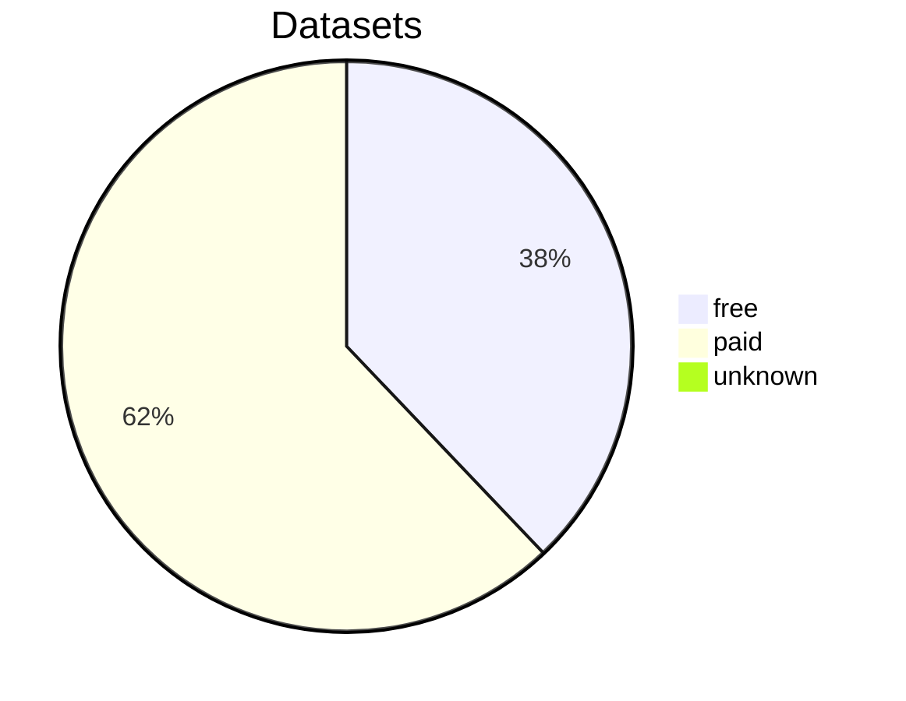
```mermaid
pie
title Datasets
  "free": 37.65548435733132
  "paid": 61.70373162457595
  "unknown": 0.6407840180927252
```
</td>
<td valign="top">

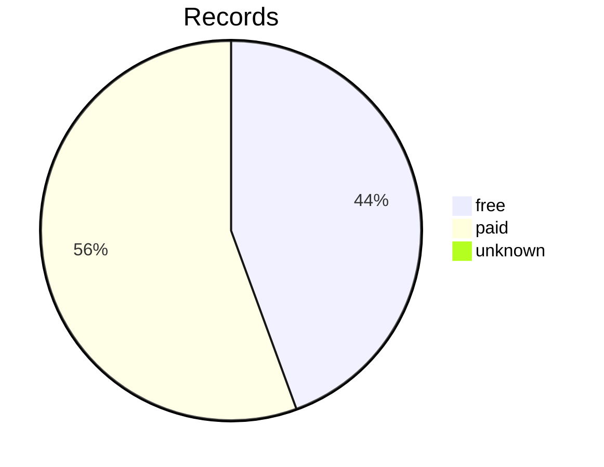
```mermaid
pie
title Records
  "free": 44.40522815673041
  "paid": 55.568906319605624
  "unknown": 0.02586552366396578
```
</td>
</tr>
</table>

Datasets By Region

<table border="1">
<tr>
<td valign="top" colspan="3">
<h2>Total</h2>
</td>
</tr>
<tr>
<td valign="top">

| title         |      datasets |       records |
| ------------- | ------------- | ------------- |
| Americas      |         1,042 | 1,643,914,473 |
| Asia          |             4 |     6,235,968 |
| Australasia   |           337 |    83,649,595 |
| Europe        |            48 |   115,165,976 |
| Great Britain |           984 | 1,649,254,268 |
| Ireland       |           237 |   168,318,802 |
| None          |             1 |         1,802 |

</td>
<td valign="top">

```mermaid
pie
title Datasets
  "americas": 39.27629099133057
  "asia": 0.15077271013946475
  "australasia": 12.702600829249905
  "europe": 1.8092725216735772
  "great britain": 37.09008669430833
  "ireland": 8.933283075763288
  "none": 0.03769317753486619
```
</td>
<td valign="top">

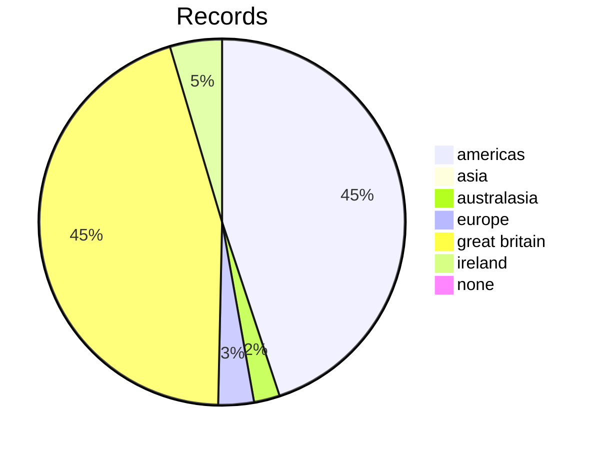
```mermaid
pie
title Records
  "americas": 44.83556913748572
  "asia": 0.1700776889523428
  "australasia": 2.281430853942716
  "europe": 3.1409980044831816
  "great britain": 44.981204906155355
  "ireland": 4.590670261840179
  "none": 0.00004914714050683418
```
</td>
</tr>
<tr>
<td valign="top" colspan="3">
<h3>Americas:</h3>
</td>
</tr>
<tr>
<td valign="top">

|         |      datasets |       records |
| ------- | ------------- | ------------- |
| free    |           458 |   820,160,980 |
| paid    |           568 |   822,818,041 |
| unknown |            16 |       935,452 |

</td>
<td valign="top">

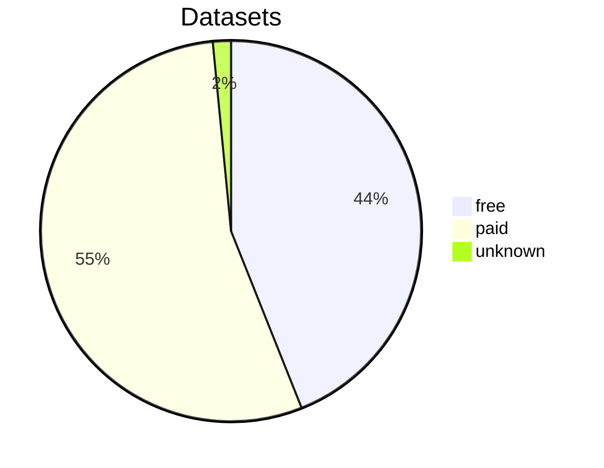
```mermaid
pie
title Datasets
  "free": 43.953934740882914
  "paid": 54.510556621881
  "unknown": 1.5355086372360844
```
</td>
<td valign="top">

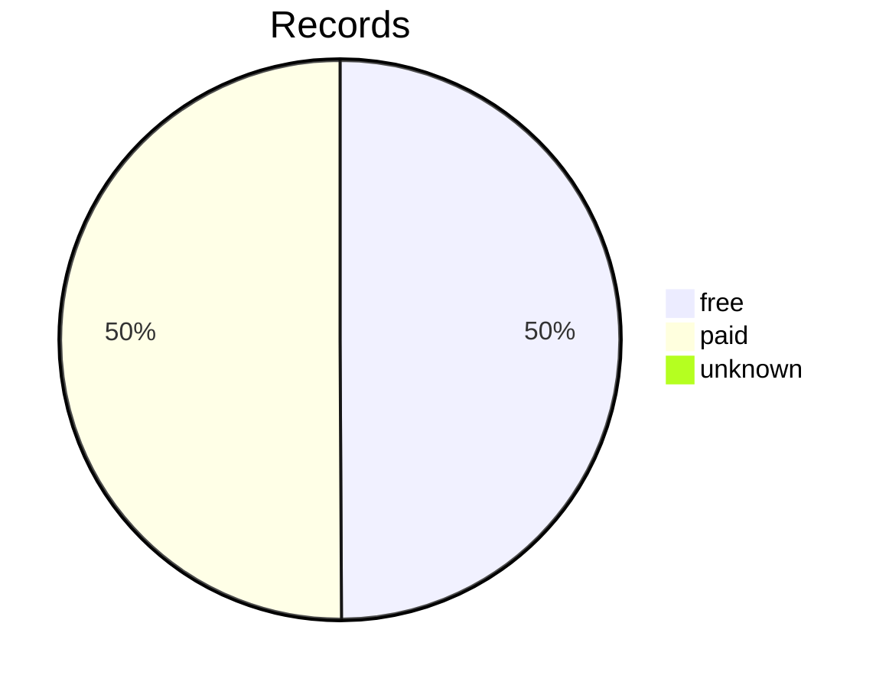
```mermaid
pie
title Records
  "free": 49.89073297124016
  "paid": 50.05236309516937
  "unknown": 0.05690393359046727
```
</td>
</tr>
<tr>
<td valign="top" colspan="3">
<h3>Asia:</h3>
</td>
</tr>
<tr>
<td valign="top">

|         |      datasets |       records |
| ------- | ------------- | ------------- |
| free    |             4 |     6,235,968 |
| paid    |             0 |             0 |
| unknown |             0 |             0 |

</td>
<td valign="top">

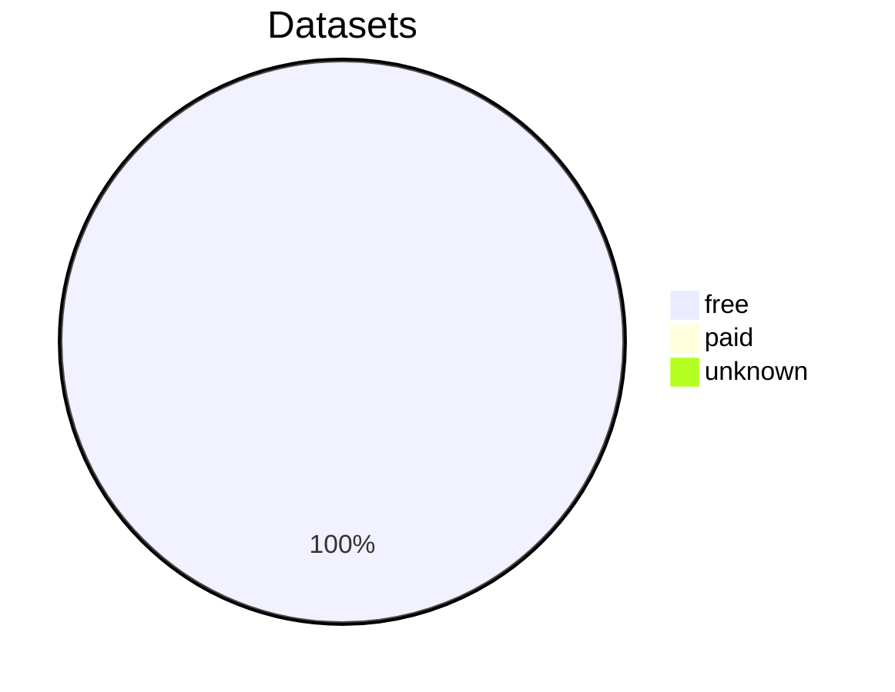
```mermaid
pie
title Datasets
  "free": 100
  "paid": 0
  "unknown": 0
```
</td>
<td valign="top">

```mermaid
pie
title Records
  "free": 100
  "paid": 0
  "unknown": 0
```
</td>
</tr>
<tr>
<td valign="top" colspan="3">
<h3>Australasia:</h3>
</td>
</tr>
<tr>
<td valign="top">

|         |      datasets |       records |
| ------- | ------------- | ------------- |
| free    |            56 |    17,304,163 |
| paid    |           281 |    66,345,432 |
| unknown |             0 |             0 |

</td>
<td valign="top">

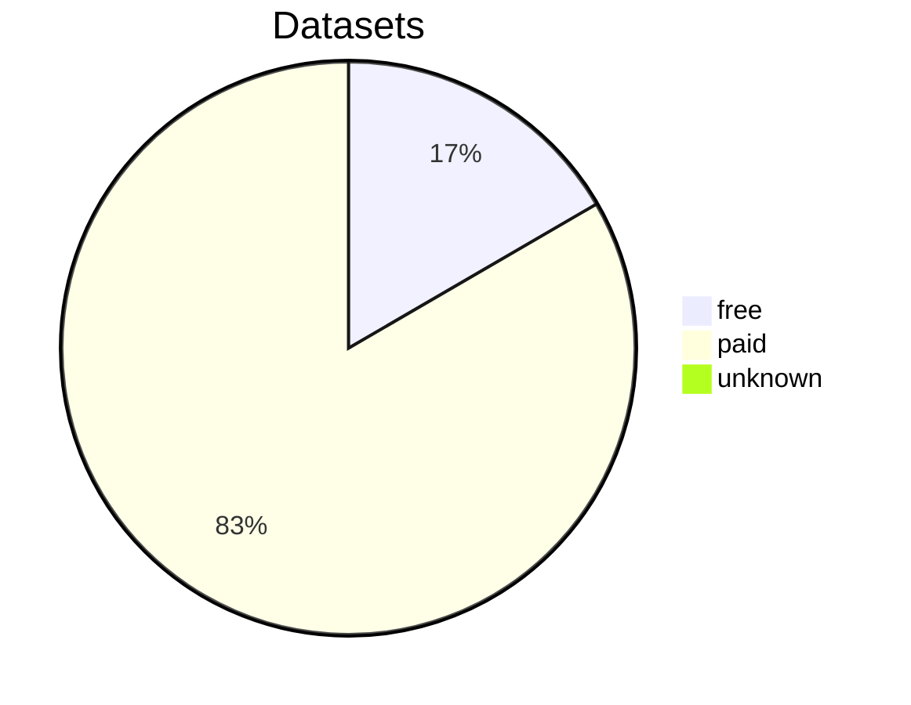
```mermaid
pie
title Datasets
  "free": 16.61721068249258
  "paid": 83.38278931750742
  "unknown": 0
```
</td>
<td valign="top">

```mermaid
pie
title Records
  "free": 20.68648748389039
  "paid": 79.31351251610961
  "unknown": 0
```
</td>
</tr>
<tr>
<td valign="top" colspan="3">
<h3>Europe:</h3>
</td>
</tr>
<tr>
<td valign="top">

|         |      datasets |       records |
| ------- | ------------- | ------------- |
| free    |            34 |   108,021,434 |
| paid    |            14 |     7,144,542 |
| unknown |             0 |             0 |

</td>
<td valign="top">

```mermaid
pie
title Datasets
  "free": 70.83333333333334
  "paid": 29.166666666666668
  "unknown": 0
```
</td>
<td valign="top">

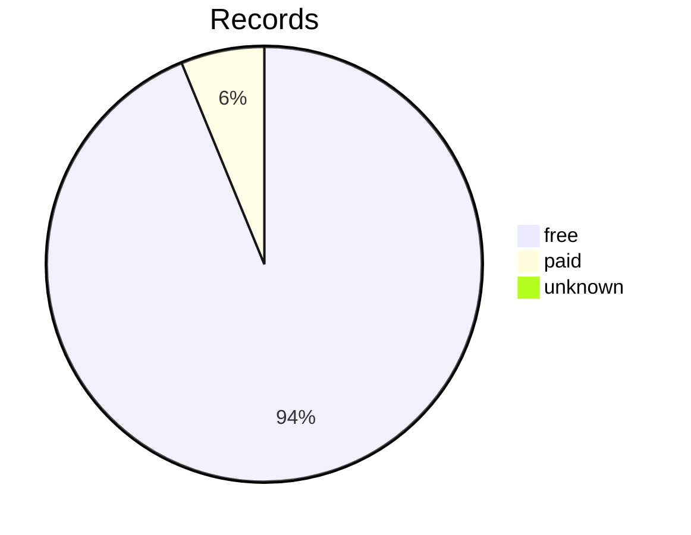
```mermaid
pie
title Records
  "free": 93.79630838191308
  "paid": 6.203691618086926
  "unknown": 0
```
</td>
</tr>
<tr>
<td valign="top" colspan="3">
<h3>Great Britain:</h3>
</td>
</tr>
<tr>
<td valign="top">

|         |      datasets |       records |
| ------- | ------------- | ------------- |
| free    |           377 |   571,090,082 |
| paid    |           606 | 1,078,151,268 |
| unknown |             1 |        12,918 |

</td>
<td valign="top">

```mermaid
pie
title Datasets
  "free": 38.3130081300813
  "paid": 61.58536585365854
  "unknown": 0.10162601626016261
```
</td>
<td valign="top">

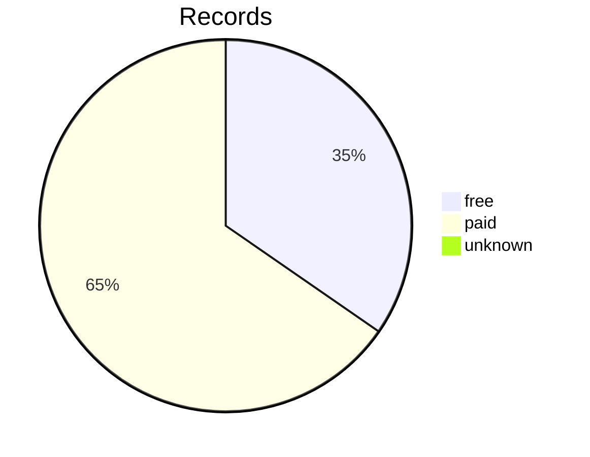
```mermaid
pie
title Records
  "free": 34.627170175072116
  "paid": 65.37204656183432
  "unknown": 0.0007832630935474407
```
</td>
</tr>
<tr>
<td valign="top" colspan="3">
<h3>Ireland:</h3>
</td>
</tr>
<tr>
<td valign="top">

|         |      datasets |       records |
| ------- | ------------- | ------------- |
| free    |            70 |   105,323,218 |
| paid    |           167 |    62,995,584 |
| unknown |             0 |             0 |

</td>
<td valign="top">

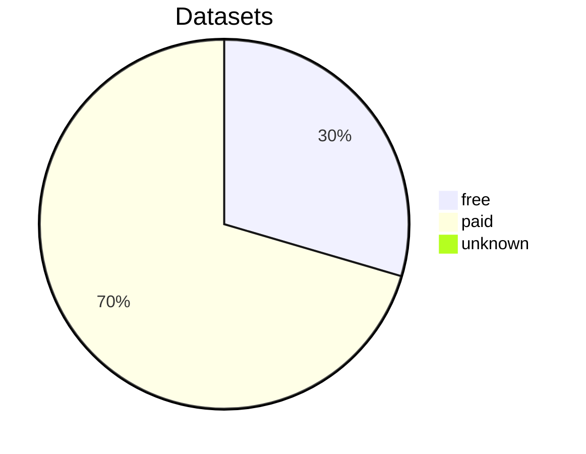
```mermaid
pie
title Datasets
  "free": 29.535864978902953
  "paid": 70.46413502109705
  "unknown": 0
```
</td>
<td valign="top">

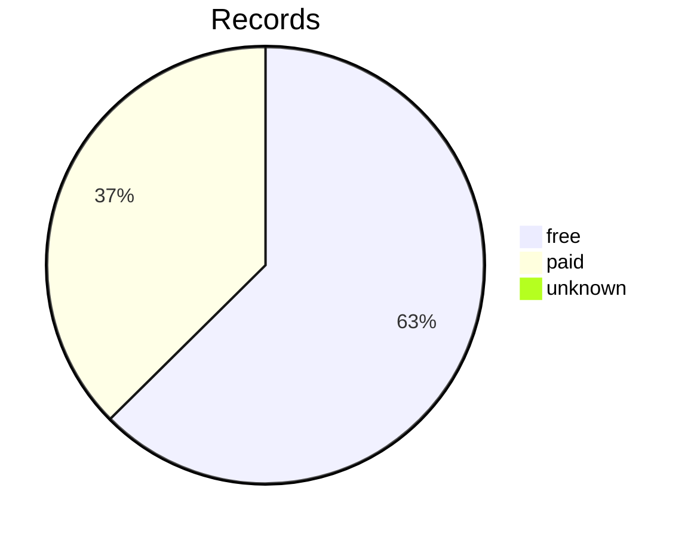
```mermaid
pie
title Records
  "free": 62.57364997167696
  "paid": 37.42635002832304
  "unknown": 0
```
</td>
</tr>
<tr>
<td valign="top" colspan="3">
<h3>None:</h3>
</td>
</tr>
<tr>
<td valign="top">

|         |      datasets |       records |
| ------- | ------------- | ------------- |
| free    |             0 |             0 |
| paid    |             1 |         1,802 |
| unknown |             0 |             0 |

</td>
<td valign="top">

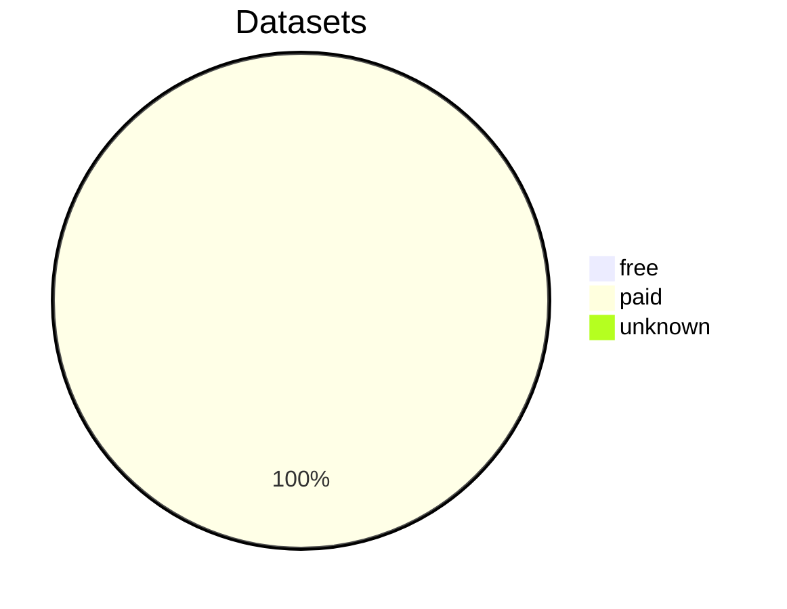
```mermaid
pie
title Datasets
  "free": 0
  "paid": 100
  "unknown": 0
```
</td>
<td valign="top">

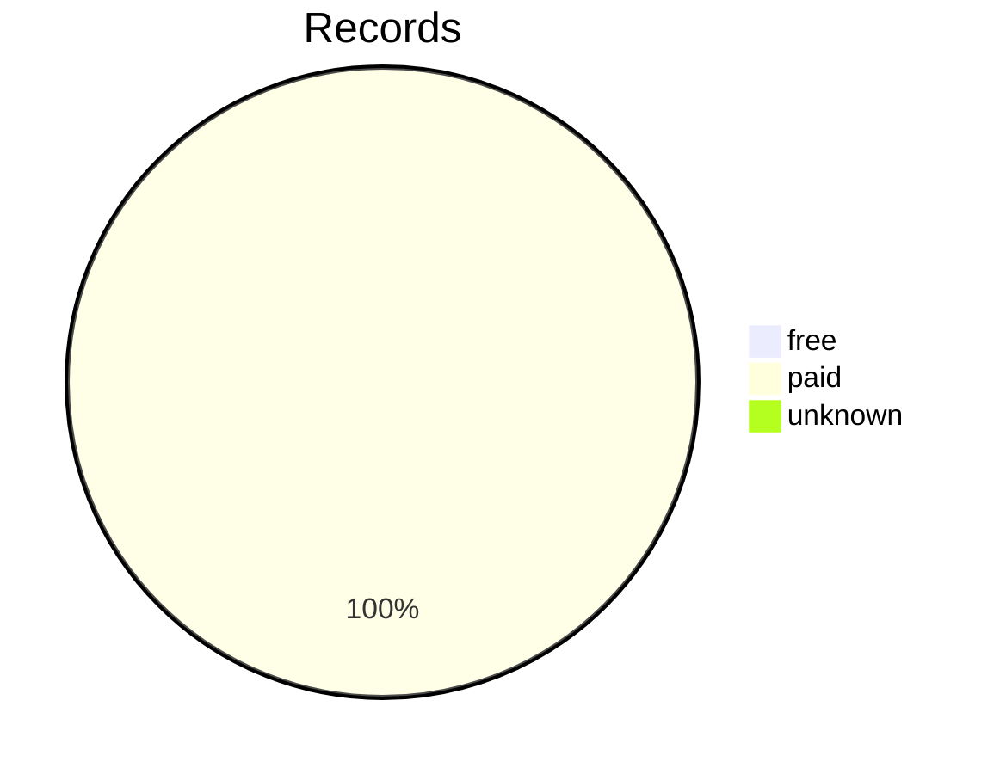
```mermaid
pie
title Records
  "free": 0
  "paid": 100
  "unknown": 0
```
</td>
</tr>
</table>

Datasets By Parent Category

<table border="1">
<tr>
<td valign="top" colspan="3">
<h2>Total</h2>
</td>
</tr>
<tr>
<td valign="top">

| title                                    |      datasets |       records |
| ---------------------------------------- | ------------- | ------------- |
| Armed Forces & Conflict                  |           354 |   116,956,446 |
| Census, Land & Surveys                   |           260 | 1,440,926,235 |
| Churches & Religion                      |            30 |     3,901,200 |
| Education & Work                         |           152 |    28,044,720 |
| Institutions & Organisations             |           182 |    70,579,417 |
| Life Events (bmds)                       |           998 | 1,556,921,957 |
| Newspapers, Directories & Social History |           581 |   181,541,661 |
| Travel & Migration                       |            96 |   267,669,248 |

</td>
<td valign="top">

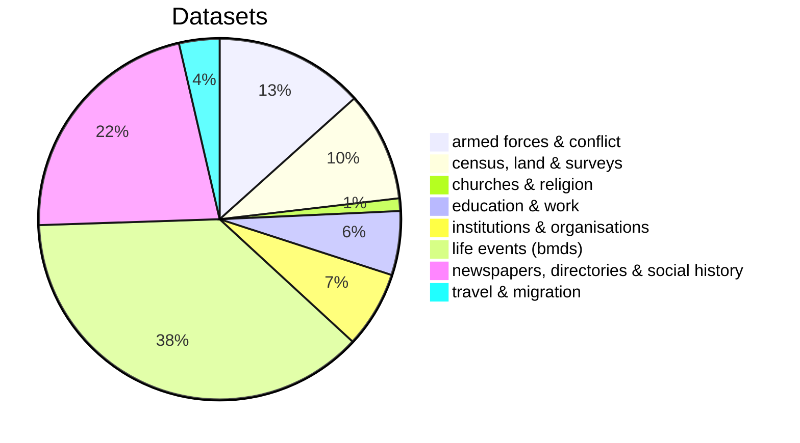
```mermaid
pie
title Datasets
  "armed forces & conflict": 13.343384847342632
  "census, land & surveys": 9.80022615906521
  "churches & religion": 1.1307953260459858
  "education & work": 5.729362985299661
  "institutions & organisations": 6.860158311345646
  "life events (bmds)": 37.617791179796455
  "newspapers, directories & social history": 21.899736147757256
  "travel & migration": 3.6185450433471544
```
</td>
<td valign="top">

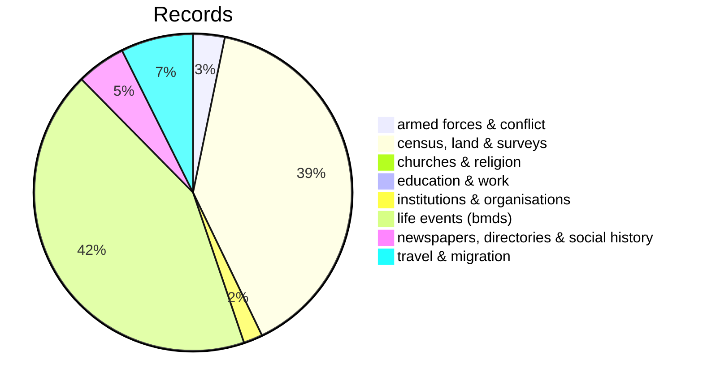
```mermaid
pie
title Records
  "armed forces & conflict": 3.1898306796570277
  "census, land & surveys": 39.299336365998094
  "churches & religion": 0.10640001362112181
  "education & work": 0.7648822387984587
  "institutions & organisations": 1.9249592254103447
  "life events (bmds)": 42.46296458315996
  "newspapers, directories & social history": 4.951306060494484
  "travel & migration": 7.300320832860513
```
</td>
</tr>
<tr>
<td valign="top" colspan="3">
<h3>Armed Forces & Conflict:</h3>
</td>
</tr>
<tr>
<td valign="top">

|         |      datasets |       records |
| ------- | ------------- | ------------- |
| free    |            92 |    18,975,797 |
| paid    |           261 |    97,926,080 |
| unknown |             1 |        54,569 |

</td>
<td valign="top">

```mermaid
pie
title Datasets
  "free": 25.98870056497175
  "paid": 73.72881355932203
  "unknown": 0.2824858757062147
```
</td>
<td valign="top">

```mermaid
pie
title Records
  "free": 16.224669651812093
  "paid": 83.72867280867956
  "unknown": 0.04665753950833971
```
</td>
</tr>
<tr>
<td valign="top" colspan="3">
<h3>Census, Land & Surveys:</h3>
</td>
</tr>
<tr>
<td valign="top">

|         |      datasets |       records |
| ------- | ------------- | ------------- |
| free    |            91 |   244,260,599 |
| paid    |           166 | 1,196,617,409 |
| unknown |             3 |        48,227 |

</td>
<td valign="top">

```mermaid
pie
title Datasets
  "free": 35
  "paid": 63.84615384615384
  "unknown": 1.153846153846154
```
</td>
<td valign="top">

```mermaid
pie
title Records
  "free": 16.951637985826526
  "paid": 83.04501506976865
  "unknown": 0.003346944404825831
```
</td>
</tr>
<tr>
<td valign="top" colspan="3">
<h3>Churches & Religion:</h3>
</td>
</tr>
<tr>
<td valign="top">

|         |      datasets |       records |
| ------- | ------------- | ------------- |
| free    |             5 |       772,740 |
| paid    |            25 |     3,128,460 |
| unknown |             0 |             0 |

</td>
<td valign="top">

```mermaid
pie
title Datasets
  "free": 16.666666666666664
  "paid": 83.33333333333334
  "unknown": 0
```
</td>
<td valign="top">

```mermaid
pie
title Records
  "free": 19.807751461088895
  "paid": 80.1922485389111
  "unknown": 0
```
</td>
</tr>
<tr>
<td valign="top" colspan="3">
<h3>Education & Work:</h3>
</td>
</tr>
<tr>
<td valign="top">

|         |      datasets |       records |
| ------- | ------------- | ------------- |
| free    |            27 |     3,777,244 |
| paid    |           125 |    24,267,476 |
| unknown |             0 |             0 |

</td>
<td valign="top">

```mermaid
pie
title Datasets
  "free": 17.763157894736842
  "paid": 82.23684210526315
  "unknown": 0
```
</td>
<td valign="top">

```mermaid
pie
title Records
  "free": 13.468645791435963
  "paid": 86.53135420856404
  "unknown": 0
```
</td>
</tr>
<tr>
<td valign="top" colspan="3">
<h3>Institutions & Organisations:</h3>
</td>
</tr>
<tr>
<td valign="top">

|         |      datasets |       records |
| ------- | ------------- | ------------- |
| free    |            49 |     8,132,750 |
| paid    |           131 |    62,421,906 |
| unknown |             2 |        24,761 |

</td>
<td valign="top">

```mermaid
pie
title Datasets
  "free": 26.923076923076923
  "paid": 71.97802197802197
  "unknown": 1.098901098901099
```
</td>
<td valign="top">

```mermaid
pie
title Records
  "free": 11.522835333139689
  "paid": 88.44208220082066
  "unknown": 0.03508246603963872
```
</td>
</tr>
<tr>
<td valign="top" colspan="3">
<h3>Life Events (bmds):</h3>
</td>
</tr>
<tr>
<td valign="top">

|         |      datasets |       records |
| ------- | ------------- | ------------- |
| free    |           630 | 1,266,473,052 |
| paid    |           359 |   289,715,528 |
| unknown |             9 |       733,377 |

</td>
<td valign="top">

```mermaid
pie
title Datasets
  "free": 63.126252505010015
  "paid": 35.97194388777555
  "unknown": 0.9018036072144289
```
</td>
<td valign="top">

```mermaid
pie
title Records
  "free": 81.34467153641664
  "paid": 18.608224175747814
  "unknown": 0.047104287835539854
```
</td>
</tr>
<tr>
<td valign="top" colspan="3">
<h3>Newspapers, Directories & Social History:</h3>
</td>
</tr>
<tr>
<td valign="top">

|         |      datasets |       records |
| ------- | ------------- | ------------- |
| free    |            76 |    16,143,684 |
| paid    |           504 |   165,350,290 |
| unknown |             1 |        47,687 |

</td>
<td valign="top">

```mermaid
pie
title Datasets
  "free": 13.080895008605854
  "paid": 86.74698795180723
  "unknown": 0.17211703958691912
```
</td>
<td valign="top">

```mermaid
pie
title Records
  "free": 8.892550564467955
  "paid": 91.08118163576789
  "unknown": 0.026267799764154408
```
</td>
</tr>
<tr>
<td valign="top" colspan="3">
<h3>Travel & Migration:</h3>
</td>
</tr>
<tr>
<td valign="top">

|         |      datasets |       records |
| ------- | ------------- | ------------- |
| free    |            29 |    69,599,979 |
| paid    |            66 |   198,029,520 |
| unknown |             1 |        39,749 |

</td>
<td valign="top">

```mermaid
pie
title Datasets
  "free": 30.208333333333332
  "paid": 68.75
  "unknown": 1.0416666666666665
```
</td>
<td valign="top">

```mermaid
pie
title Records
  "free": 26.002232053194245
  "paid": 73.98291790321763
  "unknown": 0.014850043588122608
```
</td>
</tr>
</table>

Datasets By Region And Parent Category

<table border="1">
<tr>
<td valign="top" colspan="3">
<h2>Total</h2>
</td>
</tr>
<tr>
<td valign="top">

| title                                                   |      datasets |       records |
| ------------------------------------------------------- | ------------- | ------------- |
| Americas: Armed Forces & Conflict                       |           108 |    70,170,528 |
| Americas: Census, Land & Surveys                        |           111 |   743,971,935 |
| Americas: Churches & Religion                           |             9 |     1,146,392 |
| Americas: Education & Work                              |            23 |     1,203,542 |
| Americas: Institutions & Organisations                  |            42 |     5,217,702 |
| Americas: Life Events (bmds)                            |           339 |   654,407,651 |
| Americas: Newspapers, Directories & Social History      |           360 |    15,563,051 |
| Americas: Travel & Migration                            |            50 |   152,233,672 |
| Asia: Life Events (bmds)                                |             3 |     6,164,469 |
| Asia: Newspapers, Directories & Social History          |             1 |        71,499 |
| Australasia: Armed Forces & Conflict                    |            31 |     1,152,894 |
| Australasia: Census, Land & Surveys                     |            27 |    16,170,618 |
| Australasia: Churches & Religion                        |             7 |        20,929 |
| Australasia: Education & Work                           |            38 |     2,599,122 |
| Australasia: Institutions & Organisations               |            39 |     4,349,189 |
| Australasia: Life Events (bmds)                         |            97 |    29,551,534 |
| Australasia: Newspapers, Directories & Social History   |            69 |     2,135,395 |
| Australasia: Travel & Migration                         |            29 |    27,669,914 |
| Europe: Life Events (bmds)                              |            48 |   115,165,976 |
| Great Britain: Armed Forces & Conflict                  |           200 |    44,896,154 |
| Great Britain: Census, Land & Surveys                   |            95 |   664,676,099 |
| Great Britain: Churches & Religion                      |            10 |     1,196,982 |
| Great Britain: Education & Work                         |            76 |    22,392,838 |
| Great Britain: Institutions & Organisations             |            77 |    19,760,275 |
| Great Britain: Life Events (bmds)                       |           437 |   713,179,489 |
| Great Britain: Newspapers, Directories & Social History |            76 |   158,471,686 |
| Great Britain: Travel & Migration                       |            13 |    24,680,745 |
| Ireland: Armed Forces & Conflict                        |            14 |       735,068 |
| Ireland: Census, Land & Surveys                         |            27 |    16,107,583 |
| Ireland: Churches & Religion                            |             4 |     1,536,897 |
| Ireland: Education & Work                               |            15 |     1,849,218 |
| Ireland: Institutions & Organisations                   |            24 |    41,252,251 |
| Ireland: Life Events (bmds)                             |            74 |    38,452,838 |
| Ireland: Newspapers, Directories & Social History       |            75 |     5,300,030 |
| Ireland: Travel & Migration                             |             4 |    63,084,917 |
| None: Armed Forces & Conflict                           |             1 |         1,802 |

</td>
<td valign="top">

```mermaid
pie
title Datasets
  "americas: armed forces & conflict": 10.325047801147228
  "americas: census, land & surveys": 10.611854684512428
  "americas: churches & religion": 0.8604206500956023
  "americas: education & work": 2.198852772466539
  "americas: institutions & organisations": 4.015296367112811
  "americas: life events (bmds)": 32.409177820267686
  "americas: newspapers, directories & social history": 34.41682600382409
  "americas: travel & migration": 4.780114722753346
  "asia: life events (bmds)": 0.28680688336520077
  "asia: newspapers, directories & social history": 0.09560229445506692
```
</td>
<td valign="top">

```mermaid
pie
title Records
  "americas: armed forces & conflict": 4.252371556951879
  "americas: census, land & surveys": 45.085097486575165
  "americas: churches & religion": 0.06947196882881057
  "americas: education & work": 0.07293528941946936
  "americas: institutions & organisations": 0.3161955340773684
  "americas: life events (bmds)": 39.657453935134875
  "americas: newspapers, directories & social history": 0.9431292210283996
  "americas: travel & migration": 9.225442009259808
  "asia: life events (bmds)": 0.37357012105298104
  "asia: newspapers, directories & social history": 0.004332877671242582
```
</td>
</tr>
<tr>
<td valign="top" colspan="3">
<h3>Americas: Armed Forces & Conflict:</h3>
</td>
</tr>
<tr>
<td valign="top">

|         |      datasets |       records |
| ------- | ------------- | ------------- |
| free    |            42 |     4,532,416 |
| paid    |            65 |    65,583,543 |
| unknown |             1 |        54,569 |

</td>
<td valign="top">

```mermaid
pie
title Datasets
  "free": 38.88888888888889
  "paid": 60.18518518518518
  "unknown": 0.9259259259259258
```
</td>
<td valign="top">

```mermaid
pie
title Records
  "free": 6.459144785115484
  "paid": 93.46308894811224
  "unknown": 0.07776626677228365
```
</td>
</tr>
<tr>
<td valign="top" colspan="3">
<h3>Americas: Census, Land & Surveys:</h3>
</td>
</tr>
<tr>
<td valign="top">

|         |      datasets |       records |
| ------- | ------------- | ------------- |
| free    |            54 |   175,825,797 |
| paid    |            55 |   568,110,829 |
| unknown |             2 |        35,309 |

</td>
<td valign="top">

```mermaid
pie
title Datasets
  "free": 48.64864864864865
  "paid": 49.549549549549546
  "unknown": 1.8018018018018018
```
</td>
<td valign="top">

```mermaid
pie
title Records
  "free": 23.633391090216328
  "paid": 76.36186289742234
  "unknown": 0.0047460123613399475
```
</td>
</tr>
<tr>
<td valign="top" colspan="3">
<h3>Americas: Churches & Religion:</h3>
</td>
</tr>
<tr>
<td valign="top">

|         |      datasets |       records |
| ------- | ------------- | ------------- |
| free    |             3 |       714,205 |
| paid    |             6 |       432,187 |
| unknown |             0 |             0 |

</td>
<td valign="top">

```mermaid
pie
title Datasets
  "free": 33.33333333333333
  "paid": 66.66666666666666
  "unknown": 0
```
</td>
<td valign="top">

```mermaid
pie
title Records
  "free": 62.30024284886845
  "paid": 37.69975715113155
  "unknown": 0
```
</td>
</tr>
<tr>
<td valign="top" colspan="3">
<h3>Americas: Education & Work:</h3>
</td>
</tr>
<tr>
<td valign="top">

|         |      datasets |       records |
| ------- | ------------- | ------------- |
| free    |             8 |     1,202,296 |
| paid    |            15 |         1,246 |
| unknown |             0 |             0 |

</td>
<td valign="top">

```mermaid
pie
title Datasets
  "free": 34.78260869565217
  "paid": 65.21739130434783
  "unknown": 0
```
</td>
<td valign="top">

```mermaid
pie
title Records
  "free": 99.89647224608696
  "paid": 0.10352775391303337
  "unknown": 0
```
</td>
</tr>
<tr>
<td valign="top" colspan="3">
<h3>Americas: Institutions & Organisations:</h3>
</td>
</tr>
<tr>
<td valign="top">

|         |      datasets |       records |
| ------- | ------------- | ------------- |
| free    |            29 |     5,156,287 |
| paid    |            11 |        36,654 |
| unknown |             2 |        24,761 |

</td>
<td valign="top">

```mermaid
pie
title Datasets
  "free": 69.04761904761905
  "paid": 26.190476190476193
  "unknown": 4.761904761904762
```
</td>
<td valign="top">

```mermaid
pie
title Records
  "free": 98.82294926003823
  "paid": 0.7024931665319329
  "unknown": 0.47455757342983557
```
</td>
</tr>
<tr>
<td valign="top" colspan="3">
<h3>Americas: Life Events (bmds):</h3>
</td>
</tr>
<tr>
<td valign="top">

|         |      datasets |       records |
| ------- | ------------- | ------------- |
| free    |           256 |   612,563,372 |
| paid    |            74 |    41,110,902 |
| unknown |             9 |       733,377 |

</td>
<td valign="top">

```mermaid
pie
title Datasets
  "free": 75.51622418879056
  "paid": 21.828908554572273
  "unknown": 2.6548672566371683
```
</td>
<td valign="top">

```mermaid
pie
title Records
  "free": 93.60577784565052
  "paid": 6.282154852129013
  "unknown": 0.11206730222046257
```
</td>
</tr>
<tr>
<td valign="top" colspan="3">
<h3>Americas: Newspapers, Directories & Social History:</h3>
</td>
</tr>
<tr>
<td valign="top">

|         |      datasets |       records |
| ------- | ------------- | ------------- |
| free    |            49 |    13,731,838 |
| paid    |           310 |     1,783,526 |
| unknown |             1 |        47,687 |

</td>
<td valign="top">

```mermaid
pie
title Datasets
  "free": 13.61111111111111
  "paid": 86.11111111111111
  "unknown": 0.2777777777777778
```
</td>
<td valign="top">

```mermaid
pie
title Records
  "free": 88.23358607512112
  "paid": 11.460002283613926
  "unknown": 0.3064116412649422
```
</td>
</tr>
<tr>
<td valign="top" colspan="3">
<h3>Americas: Travel & Migration:</h3>
</td>
</tr>
<tr>
<td valign="top">

|         |      datasets |       records |
| ------- | ------------- | ------------- |
| free    |            17 |     6,434,769 |
| paid    |            32 |   145,759,154 |
| unknown |             1 |        39,749 |

</td>
<td valign="top">

```mermaid
pie
title Datasets
  "free": 34
  "paid": 64
  "unknown": 2
```
</td>
<td valign="top">

```mermaid
pie
title Records
  "free": 4.226902573827425
  "paid": 95.7469869083891
  "unknown": 0.026110517783476967
```
</td>
</tr>
<tr>
<td valign="top" colspan="3">
<h3>Asia: Life Events (bmds):</h3>
</td>
</tr>
<tr>
<td valign="top">

|         |      datasets |       records |
| ------- | ------------- | ------------- |
| free    |             3 |     6,164,469 |
| paid    |             0 |             0 |
| unknown |             0 |             0 |

</td>
<td valign="top">

```mermaid
pie
title Datasets
  "free": 100
  "paid": 0
  "unknown": 0
```
</td>
<td valign="top">

```mermaid
pie
title Records
  "free": 100
  "paid": 0
  "unknown": 0
```
</td>
</tr>
<tr>
<td valign="top" colspan="3">
<h3>Asia: Newspapers, Directories & Social History:</h3>
</td>
</tr>
<tr>
<td valign="top">

|         |      datasets |       records |
| ------- | ------------- | ------------- |
| free    |             1 |        71,499 |
| paid    |             0 |             0 |
| unknown |             0 |             0 |

</td>
<td valign="top">

```mermaid
pie
title Datasets
  "free": 100
  "paid": 0
  "unknown": 0
```
</td>
<td valign="top">

```mermaid
pie
title Records
  "free": 100
  "paid": 0
  "unknown": 0
```
</td>
</tr>
<tr>
<td valign="top" colspan="3">
<h3>Australasia: Armed Forces & Conflict:</h3>
</td>
</tr>
<tr>
<td valign="top">

|         |      datasets |       records |
| ------- | ------------- | ------------- |
| free    |             4 |       165,084 |
| paid    |            27 |       987,810 |
| unknown |             0 |             0 |

</td>
<td valign="top">

```mermaid
pie
title Datasets
  "free": 12.903225806451612
  "paid": 87.09677419354838
  "unknown": 0
```
</td>
<td valign="top">

```mermaid
pie
title Records
  "free": 14.31909611811667
  "paid": 85.68090388188332
  "unknown": 0
```
</td>
</tr>
<tr>
<td valign="top" colspan="3">
<h3>Australasia: Census, Land & Surveys:</h3>
</td>
</tr>
<tr>
<td valign="top">

|         |      datasets |       records |
| ------- | ------------- | ------------- |
| free    |             4 |        62,108 |
| paid    |            23 |    16,108,510 |
| unknown |             0 |             0 |

</td>
<td valign="top">

```mermaid
pie
title Datasets
  "free": 14.814814814814813
  "paid": 85.18518518518519
  "unknown": 0
```
</td>
<td valign="top">

```mermaid
pie
title Records
  "free": 0.38407932213846124
  "paid": 99.61592067786154
  "unknown": 0
```
</td>
</tr>
<tr>
<td valign="top" colspan="3">
<h3>Australasia: Churches & Religion:</h3>
</td>
</tr>
<tr>
<td valign="top">

|         |      datasets |       records |
| ------- | ------------- | ------------- |
| free    |             0 |             0 |
| paid    |             7 |        20,929 |
| unknown |             0 |             0 |

</td>
<td valign="top">

```mermaid
pie
title Datasets
  "free": 0
  "paid": 100
  "unknown": 0
```
</td>
<td valign="top">

```mermaid
pie
title Records
  "free": 0
  "paid": 100
  "unknown": 0
```
</td>
</tr>
<tr>
<td valign="top" colspan="3">
<h3>Australasia: Education & Work:</h3>
</td>
</tr>
<tr>
<td valign="top">

|         |      datasets |       records |
| ------- | ------------- | ------------- |
| free    |             3 |        45,922 |
| paid    |            35 |     2,553,200 |
| unknown |             0 |             0 |

</td>
<td valign="top">

```mermaid
pie
title Datasets
  "free": 7.894736842105263
  "paid": 92.10526315789474
  "unknown": 0
```
</td>
<td valign="top">

```mermaid
pie
title Records
  "free": 1.7668274132572461
  "paid": 98.23317258674275
  "unknown": 0
```
</td>
</tr>
<tr>
<td valign="top" colspan="3">
<h3>Australasia: Institutions & Organisations:</h3>
</td>
</tr>
<tr>
<td valign="top">

|         |      datasets |       records |
| ------- | ------------- | ------------- |
| free    |             4 |        60,997 |
| paid    |            35 |     4,288,192 |
| unknown |             0 |             0 |

</td>
<td valign="top">

```mermaid
pie
title Datasets
  "free": 10.256410256410255
  "paid": 89.74358974358975
  "unknown": 0
```
</td>
<td valign="top">

```mermaid
pie
title Records
  "free": 1.402491361033057
  "paid": 98.59750863896694
  "unknown": 0
```
</td>
</tr>
<tr>
<td valign="top" colspan="3">
<h3>Australasia: Life Events (bmds):</h3>
</td>
</tr>
<tr>
<td valign="top">

|         |      datasets |       records |
| ------- | ------------- | ------------- |
| free    |            31 |    16,885,647 |
| paid    |            66 |    12,665,887 |
| unknown |             0 |             0 |

</td>
<td valign="top">

```mermaid
pie
title Datasets
  "free": 31.958762886597935
  "paid": 68.04123711340206
  "unknown": 0
```
</td>
<td valign="top">

```mermaid
pie
title Records
  "free": 57.139663206654525
  "paid": 42.86033679334548
  "unknown": 0
```
</td>
</tr>
<tr>
<td valign="top" colspan="3">
<h3>Australasia: Newspapers, Directories & Social History:</h3>
</td>
</tr>
<tr>
<td valign="top">

|         |      datasets |       records |
| ------- | ------------- | ------------- |
| free    |             6 |        15,560 |
| paid    |            63 |     2,119,835 |
| unknown |             0 |             0 |

</td>
<td valign="top">

```mermaid
pie
title Datasets
  "free": 8.695652173913043
  "paid": 91.30434782608695
  "unknown": 0
```
</td>
<td valign="top">

```mermaid
pie
title Records
  "free": 0.7286708079769785
  "paid": 99.27132919202302
  "unknown": 0
```
</td>
</tr>
<tr>
<td valign="top" colspan="3">
<h3>Australasia: Travel & Migration:</h3>
</td>
</tr>
<tr>
<td valign="top">

|         |      datasets |       records |
| ------- | ------------- | ------------- |
| free    |             4 |        68,845 |
| paid    |            25 |    27,601,069 |
| unknown |             0 |             0 |

</td>
<td valign="top">

```mermaid
pie
title Datasets
  "free": 13.793103448275861
  "paid": 86.20689655172413
  "unknown": 0
```
</td>
<td valign="top">

```mermaid
pie
title Records
  "free": 0.2488081459161745
  "paid": 99.75119185408381
  "unknown": 0
```
</td>
</tr>
<tr>
<td valign="top" colspan="3">
<h3>Europe: Life Events (bmds):</h3>
</td>
</tr>
<tr>
<td valign="top">

|         |      datasets |       records |
| ------- | ------------- | ------------- |
| free    |            34 |   108,021,434 |
| paid    |            14 |     7,144,542 |
| unknown |             0 |             0 |

</td>
<td valign="top">

```mermaid
pie
title Datasets
  "free": 70.83333333333334
  "paid": 29.166666666666668
  "unknown": 0
```
</td>
<td valign="top">

```mermaid
pie
title Records
  "free": 93.79630838191308
  "paid": 6.203691618086926
  "unknown": 0
```
</td>
</tr>
<tr>
<td valign="top" colspan="3">
<h3>Great Britain: Armed Forces & Conflict:</h3>
</td>
</tr>
<tr>
<td valign="top">

|         |      datasets |       records |
| ------- | ------------- | ------------- |
| free    |            41 |    14,046,825 |
| paid    |           159 |    30,849,329 |
| unknown |             0 |             0 |

</td>
<td valign="top">

```mermaid
pie
title Datasets
  "free": 20.5
  "paid": 79.5
  "unknown": 0
```
</td>
<td valign="top">

```mermaid
pie
title Records
  "free": 31.287368178574944
  "paid": 68.71263182142506
  "unknown": 0
```
</td>
</tr>
<tr>
<td valign="top" colspan="3">
<h3>Great Britain: Census, Land & Surveys:</h3>
</td>
</tr>
<tr>
<td valign="top">

|         |      datasets |       records |
| ------- | ------------- | ------------- |
| free    |            24 |    56,517,433 |
| paid    |            70 |   608,145,748 |
| unknown |             1 |        12,918 |

</td>
<td valign="top">

```mermaid
pie
title Datasets
  "free": 25.263157894736842
  "paid": 73.68421052631578
  "unknown": 1.0526315789473684
```
</td>
<td valign="top">

```mermaid
pie
title Records
  "free": 8.503003656221434
  "paid": 91.49505284076719
  "unknown": 0.0019435030113817888
```
</td>
</tr>
<tr>
<td valign="top" colspan="3">
<h3>Great Britain: Churches & Religion:</h3>
</td>
</tr>
<tr>
<td valign="top">

|         |      datasets |       records |
| ------- | ------------- | ------------- |
| free    |             1 |         6,474 |
| paid    |             9 |     1,190,508 |
| unknown |             0 |             0 |

</td>
<td valign="top">

```mermaid
pie
title Datasets
  "free": 10
  "paid": 90
  "unknown": 0
```
</td>
<td valign="top">

```mermaid
pie
title Records
  "free": 0.5408602635628607
  "paid": 99.45913973643714
  "unknown": 0
```
</td>
</tr>
<tr>
<td valign="top" colspan="3">
<h3>Great Britain: Education & Work:</h3>
</td>
</tr>
<tr>
<td valign="top">

|         |      datasets |       records |
| ------- | ------------- | ------------- |
| free    |            14 |     1,696,148 |
| paid    |            62 |    20,696,690 |
| unknown |             0 |             0 |

</td>
<td valign="top">

```mermaid
pie
title Datasets
  "free": 18.421052631578945
  "paid": 81.57894736842105
  "unknown": 0
```
</td>
<td valign="top">

```mermaid
pie
title Records
  "free": 7.574511100379505
  "paid": 92.42548889962049
  "unknown": 0
```
</td>
</tr>
<tr>
<td valign="top" colspan="3">
<h3>Great Britain: Institutions & Organisations:</h3>
</td>
</tr>
<tr>
<td valign="top">

|         |      datasets |       records |
| ------- | ------------- | ------------- |
| free    |            12 |     2,547,088 |
| paid    |            65 |    17,213,187 |
| unknown |             0 |             0 |

</td>
<td valign="top">

```mermaid
pie
title Datasets
  "free": 15.584415584415584
  "paid": 84.4155844155844
  "unknown": 0
```
</td>
<td valign="top">

```mermaid
pie
title Records
  "free": 12.88994206811393
  "paid": 87.11005793188606
  "unknown": 0
```
</td>
</tr>
<tr>
<td valign="top" colspan="3">
<h3>Great Britain: Life Events (bmds):</h3>
</td>
</tr>
<tr>
<td valign="top">

|         |      datasets |       records |
| ------- | ------------- | ------------- |
| free    |           266 |   493,925,523 |
| paid    |           171 |   219,253,966 |
| unknown |             0 |             0 |

</td>
<td valign="top">

```mermaid
pie
title Datasets
  "free": 60.86956521739131
  "paid": 39.130434782608695
  "unknown": 0
```
</td>
<td valign="top">

```mermaid
pie
title Records
  "free": 69.25683234280451
  "paid": 30.74316765719548
  "unknown": 0
```
</td>
</tr>
<tr>
<td valign="top" colspan="3">
<h3>Great Britain: Newspapers, Directories & Social History:</h3>
</td>
</tr>
<tr>
<td valign="top">

|         |      datasets |       records |
| ------- | ------------- | ------------- |
| free    |            12 |     2,277,695 |
| paid    |            64 |   156,193,991 |
| unknown |             0 |             0 |

</td>
<td valign="top">

```mermaid
pie
title Datasets
  "free": 15.789473684210526
  "paid": 84.21052631578947
  "unknown": 0
```
</td>
<td valign="top">

```mermaid
pie
title Records
  "free": 1.4372882989330977
  "paid": 98.5627117010669
  "unknown": 0
```
</td>
</tr>
<tr>
<td valign="top" colspan="3">
<h3>Great Britain: Travel & Migration:</h3>
</td>
</tr>
<tr>
<td valign="top">

|         |      datasets |       records |
| ------- | ------------- | ------------- |
| free    |             7 |        72,896 |
| paid    |             6 |    24,607,849 |
| unknown |             0 |             0 |

</td>
<td valign="top">

```mermaid
pie
title Datasets
  "free": 53.84615384615385
  "paid": 46.15384615384615
  "unknown": 0
```
</td>
<td valign="top">

```mermaid
pie
title Records
  "free": 0.2953557520245033
  "paid": 99.7046442479755
  "unknown": 0
```
</td>
</tr>
<tr>
<td valign="top" colspan="3">
<h3>Ireland: Armed Forces & Conflict:</h3>
</td>
</tr>
<tr>
<td valign="top">

|         |      datasets |       records |
| ------- | ------------- | ------------- |
| free    |             5 |       231,472 |
| paid    |             9 |       503,596 |
| unknown |             0 |             0 |

</td>
<td valign="top">

```mermaid
pie
title Datasets
  "free": 35.714285714285715
  "paid": 64.28571428571429
  "unknown": 0
```
</td>
<td valign="top">

```mermaid
pie
title Records
  "free": 31.489875766595745
  "paid": 68.51012423340426
  "unknown": 0
```
</td>
</tr>
<tr>
<td valign="top" colspan="3">
<h3>Ireland: Census, Land & Surveys:</h3>
</td>
</tr>
<tr>
<td valign="top">

|         |      datasets |       records |
| ------- | ------------- | ------------- |
| free    |             9 |    11,855,261 |
| paid    |            18 |     4,252,322 |
| unknown |             0 |             0 |

</td>
<td valign="top">

```mermaid
pie
title Datasets
  "free": 33.33333333333333
  "paid": 66.66666666666666
  "unknown": 0
```
</td>
<td valign="top">

```mermaid
pie
title Records
  "free": 73.6004961141594
  "paid": 26.399503885840602
  "unknown": 0
```
</td>
</tr>
<tr>
<td valign="top" colspan="3">
<h3>Ireland: Churches & Religion:</h3>
</td>
</tr>
<tr>
<td valign="top">

|         |      datasets |       records |
| ------- | ------------- | ------------- |
| free    |             1 |        52,061 |
| paid    |             3 |     1,484,836 |
| unknown |             0 |             0 |

</td>
<td valign="top">

```mermaid
pie
title Datasets
  "free": 25
  "paid": 75
  "unknown": 0
```
</td>
<td valign="top">

```mermaid
pie
title Records
  "free": 3.387409826422981
  "paid": 96.61259017357702
  "unknown": 0
```
</td>
</tr>
<tr>
<td valign="top" colspan="3">
<h3>Ireland: Education & Work:</h3>
</td>
</tr>
<tr>
<td valign="top">

|         |      datasets |       records |
| ------- | ------------- | ------------- |
| free    |             2 |       832,878 |
| paid    |            13 |     1,016,340 |
| unknown |             0 |             0 |

</td>
<td valign="top">

```mermaid
pie
title Datasets
  "free": 13.333333333333334
  "paid": 86.66666666666667
  "unknown": 0
```
</td>
<td valign="top">

```mermaid
pie
title Records
  "free": 45.03947073844187
  "paid": 54.960529261558136
  "unknown": 0
```
</td>
</tr>
<tr>
<td valign="top" colspan="3">
<h3>Ireland: Institutions & Organisations:</h3>
</td>
</tr>
<tr>
<td valign="top">

|         |      datasets |       records |
| ------- | ------------- | ------------- |
| free    |             4 |       368,378 |
| paid    |            20 |    40,883,873 |
| unknown |             0 |             0 |

</td>
<td valign="top">

```mermaid
pie
title Datasets
  "free": 16.666666666666664
  "paid": 83.33333333333334
  "unknown": 0
```
</td>
<td valign="top">

```mermaid
pie
title Records
  "free": 0.8929888456268726
  "paid": 99.10701115437313
  "unknown": 0
```
</td>
</tr>
<tr>
<td valign="top" colspan="3">
<h3>Ireland: Life Events (bmds):</h3>
</td>
</tr>
<tr>
<td valign="top">

|         |      datasets |       records |
| ------- | ------------- | ------------- |
| free    |            40 |    28,912,607 |
| paid    |            34 |     9,540,231 |
| unknown |             0 |             0 |

</td>
<td valign="top">

```mermaid
pie
title Datasets
  "free": 54.054054054054056
  "paid": 45.94594594594595
  "unknown": 0
```
</td>
<td valign="top">

```mermaid
pie
title Records
  "free": 75.1897870321041
  "paid": 24.810212967895893
  "unknown": 0
```
</td>
</tr>
<tr>
<td valign="top" colspan="3">
<h3>Ireland: Newspapers, Directories & Social History:</h3>
</td>
</tr>
<tr>
<td valign="top">

|         |      datasets |       records |
| ------- | ------------- | ------------- |
| free    |             8 |        47,092 |
| paid    |            67 |     5,252,938 |
| unknown |             0 |             0 |

</td>
<td valign="top">

```mermaid
pie
title Datasets
  "free": 10.666666666666668
  "paid": 89.33333333333333
  "unknown": 0
```
</td>
<td valign="top">

```mermaid
pie
title Records
  "free": 0.8885232725097783
  "paid": 99.11147672749023
  "unknown": 0
```
</td>
</tr>
<tr>
<td valign="top" colspan="3">
<h3>Ireland: Travel & Migration:</h3>
</td>
</tr>
<tr>
<td valign="top">

|         |      datasets |       records |
| ------- | ------------- | ------------- |
| free    |             1 |    63,023,469 |
| paid    |             3 |        61,448 |
| unknown |             0 |             0 |

</td>
<td valign="top">

```mermaid
pie
title Datasets
  "free": 25
  "paid": 75
  "unknown": 0
```
</td>
<td valign="top">

```mermaid
pie
title Records
  "free": 99.90259478347257
  "paid": 0.0974052165274308
  "unknown": 0
```
</td>
</tr>
<tr>
<td valign="top" colspan="3">
<h3>None: Armed Forces & Conflict:</h3>
</td>
</tr>
<tr>
<td valign="top">

|         |      datasets |       records |
| ------- | ------------- | ------------- |
| free    |             0 |             0 |
| paid    |             1 |         1,802 |
| unknown |             0 |             0 |

</td>
<td valign="top">

```mermaid
pie
title Datasets
  "free": 0
  "paid": 100
  "unknown": 0
```
</td>
<td valign="top">

```mermaid
pie
title Records
  "free": 0
  "paid": 100
  "unknown": 0
```
</td>
</tr>
</table>

Biggest Free Datasets By Count

<table border="1">
<tr>
<td valign="top" colspan="3">
<tr>
<td valign="top" colspan="3">

| dataset                                         |         count |
| ----------------------------------------------- | ------------- |
| United States Marriages                         |   249,108,042 |
| England & Wales Births 1837-2006                |   133,086,909 |
| US Census 1940                                  |   132,843,607 |
| England & Wales Marriages 1837-2005             |    95,653,033 |
| Social Security Death Index                     |    86,128,596 |
| United States Obituary Notices                  |    79,079,230 |
| England Births & Baptisms 1538-1975             |    64,372,361 |
| British & Irish Roots Collection                |    63,023,469 |
| Mexico Baptism Index 1560-1950                  |    43,301,066 |
| Germany Birth And Baptism Index 1558-1898       |    37,607,429 |
| England Marriages 1538-1973                     |    31,631,839 |
| 1881 England, Wales & Scotland Census           |    29,840,169 |
| United States Billion Graves Index              |    21,782,954 |
| Germany Marriage Index 1558-1929                |    16,829,448 |
| California Births, 1970-1995                    |    13,425,340 |
| Mexico Marriage Index 1570-1950                 |    12,483,056 |
| Scotland, Parish Births & Baptisms 1564-1929    |    10,543,847 |
| Irish Births 1864-1958                          |     9,455,120 |
| Yorkshire Baptisms                              |     9,201,991 |
| Sweden Baptisms 1611-1920                       |     9,007,881 |
| California, Death Record Index, 1940-1997       |     8,361,920 |
| Spain Baptisms 1502-1940                        |     8,330,113 |
| Ireland Roman Catholic Parish Baptisms          |     7,396,885 |
| Norway Baptisms 1634-1927                       |     7,327,082 |
| Canada Census 1911                              |     7,157,334 |
| England, Boyd's Marriage Indexes, 1538-1850     |     7,113,964 |
| Texas Divorce Indexes                           |     7,004,626 |
| Scotland, Parish Marriages & Banns 1561-1893    |     5,875,752 |
| Canada Census 1901                              |     5,167,206 |
| Philippines Deaths & Burials 1726-1957          |     5,057,703 |
| Kentucky Birth Records                          |     5,043,126 |
| Finland Baptism Index 1657-1890                 |     4,758,185 |
| Irish Marriages 1845-1958                       |     4,567,394 |
| Canada Census 1891                              |     4,539,639 |
| Yorkshire Marriages                             |     4,470,512 |
| Ireland Census 1901                             |     4,398,289 |
| Ireland Census 1911                             |     4,390,240 |
| Spain Marriages 1565-1950                       |     4,275,076 |
| Canada Census 1881                              |     4,273,962 |
| Ohio Divorce Records, 1962-2011                 |     4,259,660 |
| Peru, Lima, Civil Registration Births 1874-1996 |     3,870,981 |
| Peru Baptisms 1556-1930                         |     3,699,733 |
| Norfolk Baptisms                                |     3,600,230 |
| Kent Baptisms                                   |     3,561,462 |
| Canada Census 1871                              |     3,292,788 |
| Denmark Marriages 1635-1916                     |     3,219,876 |
| Kent Marriages And Banns                        |     3,175,396 |
| United States, National Veterans Cemetery Index |     3,166,846 |
| Denmark Baptisms 1618-1923                      |     3,148,542 |
| Nicaragua Civil Registration 1809-2011          |     3,135,468 |

</td>
</tr>
</table>

Biggest Paid Datasets By Count

<table border="1">
<tr>
<td valign="top" colspan="3">
<tr>
<td valign="top" colspan="3">

| dataset                                                        |         count |
| -------------------------------------------------------------- | ------------- |
| England & Wales, Electoral Registers 1910-1932                 |   157,221,850 |
| Uk Electoral Registers & Companies House Directors             |   124,203,354 |
| US Census 1930                                                 |   123,501,733 |
| United States, Passenger And Crew Lists                        |   118,662,176 |
| People In The News                                             |   108,735,837 |
| US Census 1920                                                 |   107,126,219 |
| US Census 1910                                                 |    92,346,580 |
| England & Wales Deaths 1837-2007                               |    87,447,278 |
| US Census 1900                                                 |    76,220,436 |
| US Census 1880                                                 |    50,358,403 |
| 1939 Register                                                  |    42,068,042 |
| US Census 1870                                                 |    40,283,252 |
| 1921 Census Of England & Wales                                 |    38,446,328 |
| 1901 England, Wales & Scotland Census                          |    37,122,307 |
| London Gazette 1665-2018                                       |    36,367,371 |
| 1911 Census For England & Wales                                |    36,356,507 |
| 1891 England, Wales & Scotland Census                          |    33,072,423 |
| US Census 1860                                                 |    27,120,064 |
| 1871 England, Wales & Scotland Census                          |    26,158,765 |
| Australia, Inward, Outward & Coastal Passenger Lists 1826-1972 |    26,092,495 |
| World War I Draft Registration Cards                           |    25,053,463 |
| Passenger Lists Leaving Uk 1890-1960                           |    24,113,153 |
| England & Wales Government Probate Death Index 1858-2019       |    24,039,482 |
| Ireland, Petty Sessions Court Registers                        |    23,500,141 |
| 1861 England, Wales & Scotland Census                          |    22,611,963 |
| 1851 England, Wales & Scotland Census                          |    20,772,495 |
| US Census 1850                                                 |    20,459,086 |
| 1841 England, Wales & Scotland Census                          |    18,436,160 |
| National Burial Index For England & Wales                      |    17,117,324 |
| World War 2 Allies Collection                                  |    15,245,278 |
| England Deaths & Burials 1538-1991                             |    14,258,318 |
| Australia Electoral Rolls                                      |    12,638,655 |
| Westminster Rate Books 1634-1900                               |    10,026,831 |
| National School Admission Registers & Log-books 1870-1914      |     9,345,644 |
| Manchester Rate Books 1706-1900                                |     9,047,281 |
| World War Ii Army Enlistment Records                           |     8,952,155 |
| British Army Service Records                                   |     8,160,633 |
| United States Naturalization Petitions                         |     8,049,054 |
| U.s. Veteran's Gravesites                                      |     7,563,258 |
| Irish Deaths 1864 - 1958                                       |     7,461,718 |
| Ireland Dog Licence Registers                                  |     7,358,407 |
| England & Wales, Electoral Registers 1832-1932                 |     6,735,615 |
| Yorkshire Burials                                              |     6,674,955 |
| England & Wales, Crime, Prisons & Punishment, 1770-1935        |     6,636,593 |
| Civil War Soldiers, 1861-1865                                  |     6,270,047 |
| Britain, Campaign, Gallantry & Long Service Medals & Awards    |     6,257,697 |
| United States, Canadian Border Crossings                       |     6,150,580 |
| United States General Land Office Records 1796-2013            |     6,076,568 |
| Ohio Deaths, 1959-2012                                         |     5,479,865 |
| Kent Electoral Registers 1570-1907                             |     4,678,563 |

</td>
</tr>
</table>

